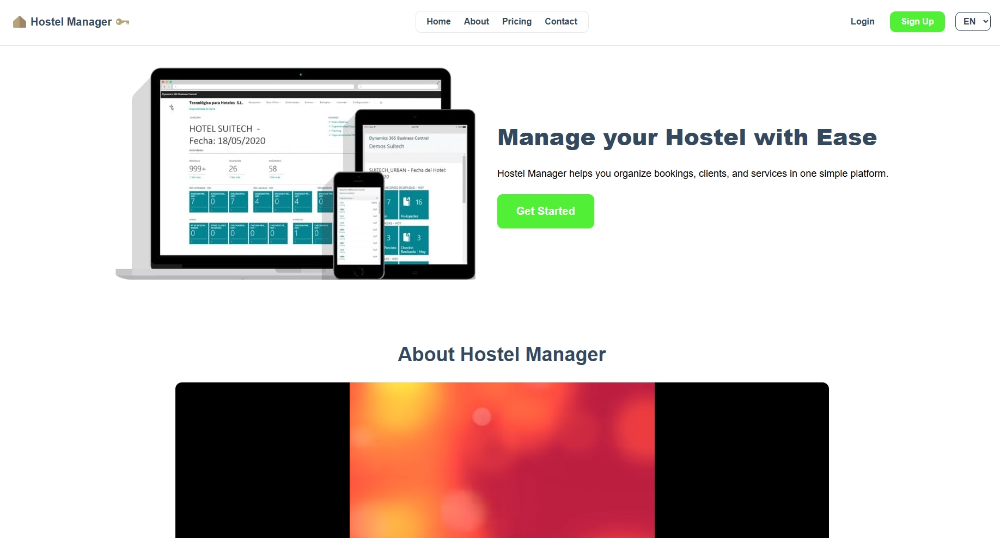
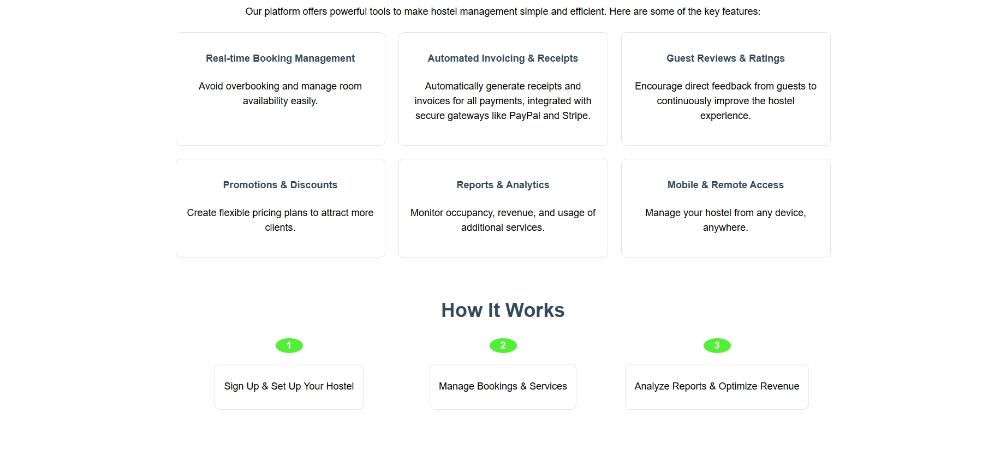
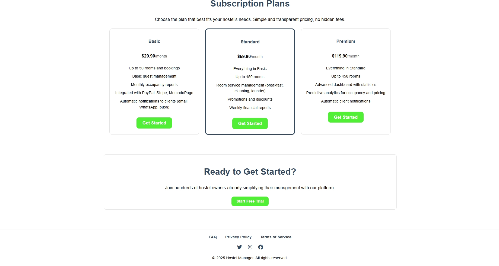
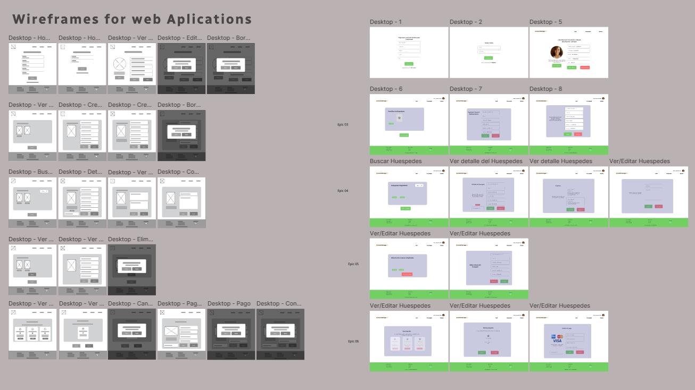
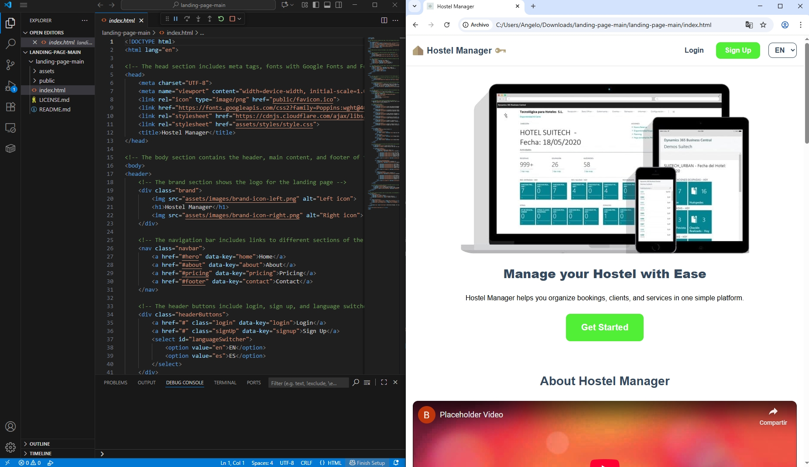
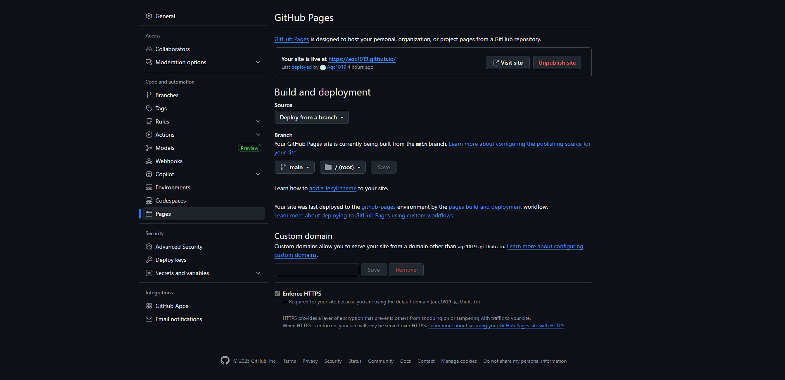
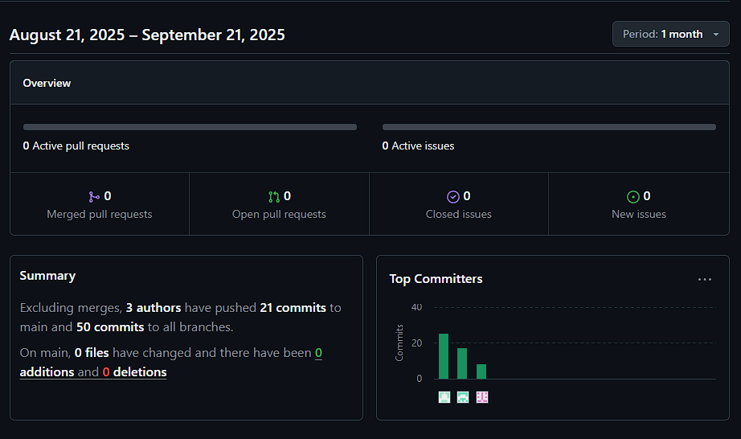

<div align="center">

# Universidad Peruana De Ciencias Aplicadas
</img>
<br/> **Carrera:** Ingeniería de Software
<br/> **Ciclo:** 202520
<br/> **Curso:** 1ASI0729 - Desarrollo de Aplicaciones Open Source 
<br/> **NRC:** 7338
<br/> **Profesor:** Velasquez Nuñez, Angel Augusto
<br/> **Informe del Trabajo Final**
<br/> **Startup:** CodeLab
<br/> **Producto:** HostelManager

| Integrantes                     | Código     |
|---------------------------------|------------|
| Bautista Rivera, Jose Diego     | u202310949 |
| Carranza Perez, Jhordi Luis     | u20191e835 |
| Janampa Gutierrez, Jhoan Darner | u202323319 |
| Pillaca Velasquez, Andre        | u202022056 |
| Quiroz Caceres, Adrian Alonso   | u202214864 |

</div>

# Registro de Versiones del Informe
| Versión | Fecha      | Autor | Descripción de modificación|
|---------|------------|-------|----------------------------|
| V0.1    | 01/09/2025 | Todos | Creación del repositorio   |

# Project Report Collaboration Insights

# Contenido
- [**Capítulo I: Introducción**](#capítulo-i-introducción)
    - [**1.1. Startup Profile.**](#11-startup-profile)
        - [**1.1.1. Descripción de la Startup.**](#111-descripción-de-la-startup)
        - [**1.1.2. Perfiles de integrantes del equipo.**](#112-perfiles-de-integrantes-del-equipo)
    - [**1.2. Solution Profile.**](#12-solution-profile)
        - [**1.2.1. Antecedentes y problemática.**](#121-antecedentes-y-problemática)
        - [**1.2.2. Lean UX Process.**](#122-lean-ux-process)
            - [**1.2.2.1. Lean UX Problem Statements.**](#1221-lean-ux-problem-statements)
            - [**1.2.2.2. Lean UX Assumptions.**](#1222-lean-ux-assumptions)
            - [**1.2.2.3. Lean UX Hypothesis Statements.**](#1223-lean-ux-hypothesis-statements)
            - [**1.2.2.4. Lean UX Canvas.**](#1224-lean-ux-canvas)
    - [**1.3. Segmentos objetivo.**](#13-segmentos-objetivo)
- [**Capítulo II: Requirements Elicitation & Analysis**](#capítulo-ii-requirements-elicitation--analysis)
    - [**2.1. Competidores.**](#21-competidores)
        - [**2.1.1. Análisis competitivo.**](#211-análisis-competitivo)
        - [**2.1.2. Estrategias y tácticas frente a competidores.**](#212-estrategias-y-tácticas-frente-a-competidores)
    - [**2.2. Entrevistas.**](#22-entrevistas)
        - [**2.2.1. Diseño de entrevistas.**](#221-diseño-de-entrevistas)
        - [**2.2.2. Registro de entrevistas.**](#222-registro-de-entrevistas)
        - [**2.2.3. Análisis de entrevistas.**](#223-análisis-de-entrevistas)
    - [**2.3. Needfinding.**](#23-needfinding)
        - [**2.3.1. User Personas.**](#231-user-personas)
        - [**2.3.2. User Task Matrix.**](#232-user-task-matrix)
        - [**2.3.3. User Journey Mapping.**](#233-user-journey-mapping)
        - [**2.3.4. Empathy Mapping.**](#234-empathy-mapping)
    - [**2.4. Big Picture EventStorming.**](#24-big-picture-eventstorming)
    - [**2.5. Ubiquitous Language.**](#25-ubiquitous-language)
- [**Capítulo III: Requirements Specification**](#capítulo-iii-requirements-specification)
    - [**3.1. User Stories.**](#31-user-stories)
    - [**3.2. Impact Mapping.**](#32-impact-mapping)
    - [**3.3. Product Backlog.**](#33-product-backlog)
- [**Capítulo IV: Product Design**](#capítulo-iv-product-design)
    - [**4.1. Style Guidelines.**](#41-style-guidelines)
        - [**4.1.1. General Style Guidelines.**](#411-general-style-guidelines)
        - [**4.1.2. Web Style Guidelines.**](#412-web-style-guidelines)
    - [**4.2. Information Architecture.**](#42-information-architecture)
        - [**4.2.1. Organization Systems.**](#421-organization-systems)
        - [**4.2.2. Labeling Systems.**](#422-labeling-systems)
        - [**4.2.3. SEO Tags and Meta Tags**](#423-seo-tags-and-meta-tags)
        - [**4.2.4. Searching Systems.**](#424-searching-systems)
        - [**4.2.5. Navigation Systems.**](#425-navigation-systems)
    - [**4.3. Landing Page UI Design.**](#43-landing-page-ui-design)
        - [**4.3.1. Landing Page Wireframe.**](#431-landing-page-wireframe)
        - [**4.3.2. Landing Page Mock-up.**](#432-landing-page-mock-up)
    - [**4.4. Web Applications UX/UI Design.**](#44-web-applications-uxui-design)
        - [**4.4.1. Web Applications Wireframes.**](#441-web-applications-wireframes)
        - [**4.4.2. Web Applications Wireflow Diagrams.**](#442-web-applications-wireflow-diagrams)
        - [**4.4.2. Web Applications Mock-ups.**](#442-web-applications-mock-ups)
        - [**4.4.3. Web Applications User Flow Diagrams.**](#443-web-applications-user-flow-diagrams)
    - [**4.5. Web Applications Prototyping.**](#45-web-applications-prototyping)
    - [**4.6. Domain-Driven Software Architecture.**](#46-domain-driven-software-architecture)
        - [**4.6.1. Design-Level EventStorming.**](#461-design-level-eventstorming)
        - [**4.6.2. Software Architecture Context Diagram.**](#462-software-architecture-context-diagram)
        - [**4.6.3. Software Architecture Container Diagrams.**](#463-software-architecture-container-diagrams)
        - [**4.6.4. Software Architecture Components Diagrams.**](#464-software-architecture-components-diagrams)
    - [**4.7. Software Object-Oriented Design.**](#47-software-object-oriented-design)
        - [**4.7.1. Class Diagrams.**](#471-class-diagrams)
    - [**4.8. Database Design.**](#48-database-design)
        - [**4.8.1. Database Diagrams.**](#481-database-diagrams)
- [**Capítulo V: Product Implementation, Validation & Deployment**](#capítulo-v-product-implementation-validation--deployment)
    - [**5.1. Software Configuration Management.**](#51-software-configuration-management)
        - [**5.1.1. Software Development Environment Configuration.**](#511-software-development-environment-configuration)
        - [**5.1.2. Source Code Management.**](#512-source-code-management)
        - [**5.1.3. Source Code Style Guide & Conventions.**](#513-source-code-style-guide--conventions)
        - [**5.1.4. Software Deployment Configuration.**](#514-software-deployment-configuration)
    - [**5.2. Landing Page, Services & Applications Implementation.**](#52-landing-page-services--applications-implementation)
        - [**5.2.1. Sprint 1**](#521-sprint-1)
            - [**5.2.1.1. Sprint Planning 1.**](#5211-sprint-planning-1)
            - [**5.2.1.2. Aspect Leaders and Collaborators.**](#5212-aspect-leaders-and-collaborators)
            - [**5.2.1.3. Sprint Backlog 1.**](#5213-sprint-backlog-1)
            - [**5.2.1.4. Development Evidence for Sprint Review.**](#5214-development-evidence-for-sprint-review)
            - [**5.2.1.5. Execution Evidence for Sprint Review.**](#5215-execution-evidence-for-sprint-review)
            - [**5.2.1.6. Services Documentation Evidence for Sprint Review.**](#5216-services-documentation-evidence-for-sprint-review)
            - [**5.2.1.7. Software Deployment Evidence for Sprint Review.**](#5217-software-deployment-evidence-for-sprint-review)
            - [**5.2.1.8. Team Collaboration Insights during Sprint.**](#5218-team-collaboration-insights-during-sprint)
- [**Conclusiones**](#conclusiones)
- [**Bibliografía**](#bibliografía)
- [**Anexos**](#anexos)

## Student Outcome
**El curso contribuye al cumplimiento del Student Outcome ABET:** ABET – EAC - Student Outcome 3
<br/> **Criterio:** Capacidad de comunicarse efectivamente con un rango de audiencias.

| Criterio específico                                                    | Acciones realizadas | Conclusiones |
|------------------------------------------------------------------------|---------------------|--------------|
| Comunica oralmente con efectividad a diferentes rangos de audiencia.   |                     |              |
| Comunica por escrito con efectividad a diferentes rangos de audiencia. |                     |              |

# Capítulo I: Introducción

## 1.1. Startup Profile
### 1.1.1. Descripción de la Startup
### 1.1.2. Perfiles de integrantes del equipo

## 1.2. Solution Profile
### 1.2.1. Antecedentes y problemática
### 1.2.2. Lean UX Process
#### 1.2.2.1. Lean UX Problem Statements
#### 1.2.2.2. Lean UX Assumptions
#### 1.2.2.3. Lean UX Hypothesis Statements
#### 1.2.2.4. Lean UX Canvas

## 1.3. Segmentos objetivo

# Capítulo II: Requirements Elicitation & Analysis

## 2.1. Competidores
### 2.1.1. Análisis competitivo
### 2.1.2. Estrategias y tácticas frente a competidores

## 2.2. Entrevistas
### 2.2.1. Diseño de entrevistas
### 2.2.2. Registro de entrevistas
### 2.2.3. Análisis de entrevistas

## 2.3. Needfinding
### 2.3.1. User Personas
### 2.3.2. User Task Matrix
### 2.3.3. User Journey Mapping
### 2.3.4. Empathy Mapping

## 2.4. Big Picture EventStorming
## 2.5. Ubiquitous Language

# Capítulo III: Requirements Specification

## 3.1. User Stories
## 3.2. Impact Mapping
## 3.3. Product Backlog

# Capítulo IV: Product Design

## 4.1. Style Guidelines
### 4.1.1. General Style Guidelines
### 4.1.2. Web Style Guidelines

## 4.2. Information Architecture
### 4.2.1. Organization Systems
### 4.2.2. Labeling Systems
### 4.2.3. SEO Tags and Meta Tags
### 4.2.4. Searching Systems
### 4.2.5. Navigation Systems

## 4.3. Landing Page UI Design
### 4.3.1. Landing Page Wireframe
### 4.3.2. Landing Page Mock-up

## 4.4. Web Applications UX/UI Design
### 4.4.1. Web Applications Wireframes
### 4.4.2. Web Applications Wireflow Diagrams
### 4.4.2. Web Applications Mock-ups
### 4.4.3. Web Applications User Flow Diagrams

## 4.5. Web Applications Prototyping

## 4.6. Domain-Driven Software Architecture
### 4.6.1. Design-Level EventStorming
### 4.6.2. Software Architecture Context Diagram
### 4.6.3. Software Architecture Container Diagrams
### 4.6.4. Software Architecture Components Diagrams

## 4.7. Software Object-Oriented Design
### 4.7.1. Class Diagrams

## 4.8. Database Design
### 4.8.1. Database Diagrams

# Capítulo V: Product Implementation, Validation & Deployment

## 5.1. Software Configuration Management

En esta sección el equipo define las decisiones, herramientas y convenciones necesarias para mantener la consistencia durante todo el ciclo de desarrollo del proyecto “Hostel Manager”. Esto incluye la gestión del entorno de desarrollo, la administración del código fuente, las guías de estilo de programación y la configuración de despliegue.
### 5.1.1. Software Development Environment Configuration

Asegurando la homogeneidad entre los integrantes del equipo, se establecen las siguientes herramientas y entornos de desarrollo del proyecto:

| Herramienta                 | Propósito                                                  | Tipo        | Referencia/Descarga                                                   |
|-----------------------------|------------------------------------------------------------|-------------|-----------------------------------------------------------------------|
| Visual Studio Code          | Desarrollo de la Landing Page                              | IDE         | https://code.visualstudio.com/                                        |
| JetBrains WebStorm (Angular CLI) | Desarrollo del Frontend Web Application en Angular       | IDE         | https://www.jetbrains.com/help/webstorm/angular.html                  |
| JetBrains IntelliJ IDEA     | Desarrollo del Backend (RESTful API) en Node.js/Java       | IDE         | https://www.jetbrains.com/idea/                                       |
| Node.js                     | Entorno de ejecución para el Backend y gestión de dependencias (npm) | Runtime     | https://nodejs.org/es                                                 |
| PostgreSQL                  | Base de datos principal del sistema.                       | DBMS        | https://www.postgresql.org/                                           |
| MySQL Server                | Base de datos alternativa para pruebas e integraciones.    | DBMS        | https://www.mysql.com/                                                |
| Postman                     | Pruebas de endpoints y validación de APIs                  | Testing Tool| https://www.postman.com/                                              |
| GitHub                      | Repositorios de control de versiones                       | SCM         | https://github.com/                                                   |
| Figma                       | Diseño de UI/UX para Landing Page y WebApp                 | Diseño      | https://www.figma.com/es-es/                                          |

### 5.1.2. Source Code Management

Para llevar una correcta administración del código fuente se utilizará “GitHub” como plataforma central de control de versiones. Cada módulo del proyecto tendrá su propio repositorio:
 
 - Landing Page: https://github.com/upc-pre-202520-1asi0729-7338-CodeLab/LandingPage.git
 - Frontend WebApp: Por definir.
 - Web Service (API): Por definir.

GitFlow Workflow:

Se adoptará el modelo de branching “GitFlow” (Vincent Driessen) con las siguientes ramas principales:

 - main: versión completa en producción.
 - develop: integración de nuevas funcionalidades antes del release.
 - feat/nombre: ramas para nuevas características, en nuestro caso dividida en capítulos. Ejemplo: feat/chapter-1

Conventional Commits:

Se usará el estándar de Conventional Commits para mensajes de los commits:
 - feat: nueva funcionalidad en código.
 - fix: correción de bug.
 - docs: cambios en documentación.
 - style: formato y estilo (sin cambios funcionales).
 - refactor: cambios internos en el código.
 - test: pruebas añadidas o modificadas.
Ejemplo: git commit -m “feat: add room service request module”

### 5.1.3. Source Code Style Guide & Conventions

A continuación se mencionan las convenciones y guías de estilo adoptadas para el desarrollo del proyecto **HostelManager**, siguiendo lineamientos internacionales y buenas prácticas de codificación.  
Toda la nomenclatura será escrita en **inglés**, independientemente del lenguaje utilizado.  

El proyecto se desarrollará en tres entornos principales:  
- **Visual Studio Code** para la Landing Page (HTML, CSS y JavaScript).  
- **WebStorm** para el frontend en **Vue/TypeScript**.  
- **JetBrains IntelliJ IDEA** para el backend en **Node.js/Java**.  


#### HTML
- Declarar el tipo de documento en la primera línea.  
- Usar etiquetas en minúscula.  
- Cerrar todas las etiquetas.  
- Atributos en minúscula y siempre entre comillas dobles.  
- Todas las imágenes deben incluir `alt`, `width` y `height`.  
- Evitar espacios innecesarios en atributos.  

```html
<!-- Declaración del tipo de documento -->
<!DOCTYPE html>

<!-- Uso de etiquetas en minúscula -->
<section>
  <p>This is a paragraph.</p>
</section>

<!-- Atributos en minúscula y entre comillas -->
<div class="menu"></div>

<!-- Imagen con alt, width y height -->


<!-- Evitar espacios innecesarios en atributos -->
<link rel="stylesheet" href="style.css" />
 ```

#### CSS

- Se adopta la metodología BEM (Block, Element, Modifier).

- Indentar con 2 espacios.

- Evitar IDs, preferir clases.

```html

/* Block */
.card {
  background-color: #eee; /* Fondo gris claro */
}

/* Element */
.card__title {
  color: #111; /* Texto oscuro */
}

/* Modifier */
.card--dark {
  background-color: #111; /* Fondo oscuro */
}


 ```

#### JavaScript

- Basado en las guías de MDN y W3C.

- Usar comillas simples ' '.

- Llaves de apertura en la misma línea.

- Punto y coma obligatorio.

- Arrow functions para callbacks.

- Constantes en UPPER_CASE_SNAKE_CASE.

 ``` html

// Saludo de ejemplo
const greeting = 'Hello World';

// Condición con llaves en la misma línea
if (true) {
  console.log('Valid');
}

// Arrow function
const sum = (a, b) => a + b;

// Constante global
const API_URL = 'https://api.hostelmanager.com';


 ```

#### TYPESCRIPT (Angular-Frontend)

Componentes y clases: PascalCase.
Interfaces: prefijo “I” (ejemplo: IReservation).
Servicios: sufijo “Service” (ejemplo: BookingService).
Módulos: PascalCase (ejemplo: ReservationModule).
Props y variables: camelCase.

``` 
@Component({
  selector: 'app-booking',
  templateUrl: './booking.component.html',
  styleUrls: ['./booking.component.css']
})
export class BookingComponent {
  reservationId: number;

  constructor(private bookingService: BookingService) {}

  confirmBooking(): void {
    this.bookingService.confirm(this.reservationId);
  }
}
```


#### Java (Backend)

- Paquetes: lowercase.

- Clases: PascalCase.

- Métodos y variables: camelCase.

- Constantes: UPPER_CASE.

- Apertura de llaves en la misma línea.

- Usar final para constantes inmutables.

- Manejar excepciones solo cuando sea necesario.

```html

// Clase Reservation que representa una reserva
public class Reservation {
    // Nombre del huésped
    private String guestName;

    // Número de habitación
    private int roomNumber;

    /**
     * Método que confirma la reserva.
     * Ejemplo de uso de Javadoc para documentación.
     */
    public void confirmBooking() {
        System.out.println("Booking confirmed");
    }
}

```

Estructura de llaves: apertura en la misma línea.
Usar “final” para constantes inmutables.
Manejo de excepciones con “try/catch” solo cuando sea necesario.

### 5.1.4. Software Deployment Configuration

La estrategia de despliegue se realizará considerando cada componente del sistema:
Landing Page:
Hospedaje en GitHub Pages o Vercel.
Proceso:
Push en rama “main”.
GitHub Actions ejecuta build automático.
Publicación automática en URL de producción.

Frontend Web Application (Angular):
Hospedaje en Vercel o Netlify.
Proceso:
Merge a “main” desde “develop”.
Pipeline CI/CD ejecuta “ng build –prod”.
Despliegue automático en entorno productivo.

Backend (RESTful API en Node.js):
Hospedaje en Heroku, Render o AWS EC2.
Proceso:
Pipeline en CI/CD compila y ejecuta pruebas.
Despliegue de contenedor Docker en servidor.
Base de datos conectada a PostgreSQL en AWS RDS o ElephantSQL.

Base de datos:
PostgreSQL desplegado en entorno cloud (AWS RDS o ElephantSQL).
Migraciones administrativas con Sequelize o TypeORM.

Notificaciones y servicios externos:
Integración con APIs externas (Stripe, PayPal, MercadoPago, WhatsApp Cloud API).
Variables sensibles gestionadas mediante “.env” y GitHub Secrets.

#### Estrategia de Despliegue

La estrategia de despliegue se realizará considerando cada componente del sistema:

#### Landing Page
- **Hospedaje:** GitHub Pages o Vercel.  
- **Proceso:**
  1. Push en rama `main`.
  2. GitHub Actions ejecuta build automático.
  3. Publicación automática en URL de producción.

#### Frontend Web Application (Vue)
- **Hospedaje:** Vercel o Netlify.  
- **Proceso:**
  1. Merge a `main` desde `develop`.
  2. Pipeline CI/CD ejecuta `npm run build`.
  3. Despliegue automático en entorno productivo.

#### Backend (RESTful API en Node.js)
- **Hospedaje:** Heroku, Render o AWS EC2.  
- **Proceso:**
  1. Pipeline en CI/CD compila y ejecuta pruebas.
  2. Despliegue de contenedor **Docker** en servidor.
  3. Base de datos conectada a **PostgreSQL** en AWS RDS o ElephantSQL.

#### Base de Datos
- **Motor:** PostgreSQL desplegado en entorno cloud (AWS RDS o ElephantSQL).  
- **Migraciones:** Administradas con **Sequelize** o **TypeORM**.

#### Notificaciones y Servicios Externos
- **Integraciones:** Stripe, PayPal, MercadoPago, WhatsApp Cloud API.  
- **Seguridad:** Variables sensibles gestionadas mediante `.env` y **GitHub Secrets**.

## 5.2. Landing Page, Services & Applications Implementation
### 5.2.1. Sprint 1

El primer sprint es un hito importante en nuestro proceso de desarrollo ágil. Durante este período, nos enfocamos en la implementación de las características y funcionalidades prioritarias identificadas en la planificación inicial. Esto implica traducir los requisitos y especificaciones en código funcional, desarrollando las bases de nuestro producto de manera iterativa.

#### 5.2.1.1. Sprint Planning 1

El sprint planning es una reunión en la metodología ágil donde el equipo planifica las actividades del próximo sprint. Define qué trabajo se hará, cuánto tiempo tomará y quién será responsable. El objetivo es establecer un plan claro y alcanzable para el equipo, fomentando la colaboración y asegurando que todos estén alineados en cuanto a objetivos y prioridades.

<table  style="text-align: center;">
    <tbody>
        <tr>
			<td colspan="1">Sprint #</td>
            <td colspan="1"> Sprint 1  </td>
		</tr>
        <tr>
			<td colspan="2">Sprint Planning Background </td>
		</tr>
        <tr>
			<td colspan="1">Date</td>
            <td colspan="1"> 2025-09-21 </td>
		</tr>
        <tr>
			<td colspan="1">Time</td>
            <td colspan="1"> 11:00 PM </td>
		</tr>
        <tr>
			<td colspan="1">Location</td>
            <td colspan="1">Microsoft Teams (Reunion virtual)</td>
		</tr>
        <tr>
			<td colspan="1">Prepared By</td>
            <td colspan="1">Bautista Rivera, José Diego</td>
		</tr>
        <tr>
			<td colspan="1"> Attendees (to planning meeting)</td>
            <td colspan="1">Bautista Rivera, Jose Diego // Carranza Perez, Jhordi Luis //  Janampa Gutierrez, Jhoan Darner // Quiroz Caceres, Adrian Alonso // Pillaca Velasquez, Andre </td>
		</tr>
         <tr>
			<td colspan="1">Sprint 1 – 1 Review Summary </td>
            <td colspan="1">En el Sprint 1 se definieron el alcance general del proyecto y los objetivos principales que guiarán el desarrollo del MVP. Se realizaron los wireframes tanto para la landing page como para el frontend, permitiendo establecer una visión clara del diseño y la experiencia de usuario. Además, se completó el despliegue de la landing page, dejándola operativa en el entorno de producción. Este sprint sentó las bases visuales y estratégicas del proyecto, alineando al equipo en torno a una misma dirección.</td>
		</tr>
         <tr>
			<td colspan="1">Sprint 1 – 1 Retrospective Summary </td>
            <td colspan="1">Durante este Sprint 1 se presentaron dificultades en la organización y gestión del tiempo, lo que representó un desafío para el equipo. Sin embargo, a pesar de estos inconvenientes, se logró completar el trabajo dentro del plazo establecido. Este resultado dejó en evidencia la necesidad de mejorar la planificación y coordinación interna, aspectos que se abordarán con mayor atención en los próximos sprints para optimizar la eficiencia y el trabajo en equipo."</td>
		</tr>
         <tr>
			<td colspan="2">Sprint Goal & User Stories </td>
		</tr>
         <tr>
			<td colspan="1">Sprint 1 Goal</td>
            <td colspan="1">En este Sprint se cumplieron los objetivos planteados, entre los que se incluyeron la definición del alcance, propósito y objetivos del proyecto. Además, se logró desplegar correctamente la landing page desde el repositorio, asegurando su funcionamiento sin inconvenientes. También se completó el diseño inicial para el frontend, lo que sienta una base visual sólida para el desarrollo posterior."</td>
		</tr>
        <tr>
			<td colspan="1">Sprint 1 Velocity </td>
            <td colspan="1">Para este sprint se han elegido 7 User Stories.</td>
		</tr>
        <tr>
			<td colspan="1">Sum of Story Points </td>
            <td colspan="1">35</td>
		</tr>
</tbody>
</table>

#### 5.2.1.2. Aspect Leaders and Collaborators
La tabla Aspect Leaders and Collaborators es una herramienta de gestión esencial que proporciona una visión clara y concisa de las responsabilidades individuales dentro del equipo en relación con los diversos aspectos del Sprint.

| Team Member (Last Name, First Name) | GitHub Username    | Landing Page (L/C) | Front-End Prototype (L/C) | Documentation (L/C) |
|---|---|---|---|---|
| Bautista Rivera, Jose Diego | Gogotes17 | C | L |  L |
| Carranza Perez, Jhordi Luis | CarPer2002 | C | C |  C |
| Janampa Gutierrez, Jhoan Darner | orraiAKBDFSK | L | C |  C |
| Quiroz Caceres, Adrian Alonso | Aqc1019 | L | C | C  |
| Pillaca Velasquez, Andre | Andreeeee1234 | C | C | C  |

#### 5.2.1.3. Sprint Backlog 1

En este primer sprint, nos enfocamos en la implementación de la Landing Page del sistema, abarcando la estructura general, el diseño visual y la navegación básica. Además, se trabajó en el prototipo visual del frontend, permitiendo validar las principales funcionalidades desde la perspectiva del usuario.

### Sprint Backlog 1 - Entregables: Landing Page + Prototipo Web

| # | User Story ID | Título                       | Prioridad | Story Points | Estado     |
|---|---------------|------------------------------|-----------|--------------|------------|
| 1 | US25          | Información en landing page  | Alta      | 3            | Hecho      |
| 2 | US26          | Registro rápido en landing   | Media     | 5            | Hecho      |
| 3 | US27          | Formulario de contacto       | Media     | 3            | Hecho      |
| 4 | US28          | Visualizar planes y precios  | Alta      | 3            | Hecho      |
| 5 | US01          | Buscar disponibilidad        | Alta      | 5            | Prototipo  |
| 6 | US02          | Crear reserva                | Alta      | 8            | Prototipo  |
| 7 | US05          | Reserva en línea             | Alta      | 8            | Prototipo  |
| 8 | -             | Documentación del Sprint     | Media     | 3  | Hecho      |
| 9 | -             | Despliegue de Landing Page   | Alta      | 3  | Hecho      |

#### 5.2.1.4. Development Evidence for Sprint Review

En esta sección se explican y presentan los avances de implementación en relación con la solución desarrollada, según el alcance definido para el sprint. En esta iteración, se completó la implementación de la Landing Page en su totalidad.

| Repository | Branch | Commit ID | Commit Message | Commit Message Body | Commited on (Date) |
| ---------- | ------ | --------- | -------------- | ------------------- | ------------------ |
|upc-pre-202520-1asi0729-7338-CodeLab/LandingPage|main|74c53d5|Initial commit|-|20/09/2025|
|upc-pre-202520-1asi0729-7338-CodeLab/LandingPage|main|ca89c80|feat: Add style in the project|-|20/09/2025|
|upc-pre-202520-1asi0729-7338-CodeLab/LandingPage|main|2925f46|feat: Add functional in Javascript|-|20/09/2025|
|upc-pre-202520-1asi0729-7338-CodeLab/LandingPage|main|aad5c44|feat: upgrade landing page style.|-|20/09/2025|


#### 5.2.1.5. Execution Evidence for Sprint Review

Para este sprint, se logró implementar y desplegar correctamente la Landing Page de la aplicación, cumpliendo con el diseño y los requerimientos establecidos para la plataforma web del negocio. A continuación, se presentan capturas de las vistas implementadas correspondientes a esta sección.






#### 5.2.1.6. Services Documentation Evidence for Sprint Review

En esta sección se muestra la ejecución funcional de la landing page, junto con los wireframes y mockups correspondientes al diseño del frontend. Esto permite visualizar el resultado actual y compararlo con las etapas previas de diseño para validar la coherencia entre la planificación y la implementación.





#### 5.2.1.7. Software Deployment Evidence for Sprint Review

Para realizar el despligue de la landing page, se utilizó la herramienta Github Pages el cuál permite desplegar páginas estáticas de forma sencilla y veloz. Además, proporciona un pipeline de CI/CD que permite desplegar a producción cada vez que se realiza un commit en la rama 'main'. 

Landing Page: https://aqc1019.github.io



#### 5.2.1.8. Team Collaboration Insights during Sprint

Esta sección proporciona una visión detallada sobre cómo colaboró el equipo durante el desarrollo del sprint.




### 5.2.2. Sprint 2

#### 5.2.2.1. Sprint Planning 2

El **Sprint 2** representa la segunda fase clave en el proceso de desarrollo ágil del proyecto **Codelab**. En este período, el equipo se enfocó en la **implementación del Frontend Web Application** dirigido a los usuario administradores de hoteles, donde se desarrollaron los **bounded contexts principales** que estructuran la lógica funcional del producto.  
El objetivo principal de este sprint fue construir la aplicación base del panel administrativo, garantizando la integración entre módulos y asegurando una experiencia de usuario coherente, fluida y funcional.

| Campo | Detalle |
|--------|----------|
| **Sprint #** | Sprint 2 |
| **Date** | 2025-10-01 |
| **Time** | 10:30 PM |
| **Location** | Microsoft Teams (Reunión virtual) |
| **Prepared By** | Bautista Rivera, José Diego |
| **Attendees (to planning meeting)** | Bautista Rivera, José Diego // Carranza Pérez, Jhordi Luis // Janampa Gutiérrez, Jhoan Darner // Quiroz Cáceres, Adrián Alonso |

### Sprint 2 – Review Summary  
Durante este sprint se implementó la **aplicación web**, integrando los bounded context definidos en la arquitectura del sistema. Se desarrollaron los módulos de **autenticación, gestión de habitaciones, reservas, huéspedes y reportes**, logrando una aplicación funcional con navegación completa, componentes dinámicos y comunicación con los servicios internos mediante HTTP.  
Asimismo, se aplicaron prácticas de control de versiones y coordinación entre ramas en GitHub para mantener una integración continua y estable del código.

### Sprint 2 – Retrospective Summary  
A lo largo del Sprint 2, el equipo enfrentó nuevos desafíos relacionados con la integración de componentes y la organización del código en Angular. Sin embargo, mediante la comunicación constante y la colaboración, se logró consolidar una estructura modular y escalable.  
Como área de mejora, se identificó la necesidad de optimizar la gestión de tiempos en la implementación de formularios complejos y validaciones. Pese a estos retos, se cumplieron los objetivos planteados dentro del periodo establecido, demostrando una mejora significativa en la coordinación técnica del equipo.

## Sprint Goal & User Stories

**Sprint 2 Goal**  
Desarrollar la **Web Application del sistema**, implementando los bounded context principales (Auth, Rooms, Booking, Clientes y Reportes). El objetivo fue disponer de una plataforma funcional que permita a los administradores de hoteles gestionar reservas, huéspedes, habitaciones y reportes dentro de un entorno moderno, modular y con autenticación segura.

**Sprint 2 Velocity**  
Para este sprint se han priorizado **10 User Stories**, con un total de **48 story points**.

| # | User Story ID | Título | Prioridad | Story Points | Estado |
|---|----------------|---------|------------|---------------|---------|
| 1 | US21 | Autenticación segura | Alta | 5 | Hecho |
| 2 | US22 | Recuperar contraseña | Media | 3 | Hecho |
| 3 | US23 | Gestión de roles | Media | 5 | Hecho |
| 4 | US07 | Registrar huésped | Alta | 5 | Hecho |
| 5 | US08 | Actualizar datos de huésped | Media | 3 | Hecho |
| 6 | US01 | Buscar disponibilidad | Alta | 5 | Hecho |
| 7 | US02 | Crear reserva | Alta | 5 | Hecho |
| 8 | US09 | Check-in digital | Media | 5 | Hecho |
| 9 | US10 | Check-out digital | Media | 4 | Hecho |
| 10 | US19 | Reporte financiero por fechas | Alta | 8 | Hecho |
| - | - | Documentación del Sprint | Media | 2 | Hecho |
| - | - | Despliegue de la aplicación web | Alta | 3 | Hecho |

#### 5.2.2.2. Aspect Leaders and Collaborators

| Team Member (Last Name, First Name) | GitHub Username | Auth Context (L/C) | Rooms Context (L/C) | Booking Context (L/C) | Clientes Context (L/C) | Reportes Context (L/C) | Documentation (L/C) |
|------------------------------------|------------------|---------------------|----------------------|------------------------|-------------------------|------------------------|----------------------|
| Bautista Rivera, José Diego | Gogotes17 | L | C | C | - | - | L |
| Carranza Pérez, Jhordi Luis | CarPer2002 | C | C | L | L | - | C |
| Janampa Gutiérrez, Jhoan Darner | orraiAKBDFSK | - | L | C | C | - | C |
| Quiroz Cáceres, Adrián Alonso | Aqc1019 | - | - | - | C | L | C |

#### 5.2.2.3. Sprint Backlog 2

En este sprint se implementaron los **bounded contexts** definidos en la arquitectura del sistema para el entorno web administrativo:

- **Auth Context:**  
  Implementación del módulo de autenticación, registro, gestión de roles y permisos de acceso mediante JWT.
  
- **Rooms Context:**  
  Desarrollo del CRUD de habitaciones y validación de disponibilidad en tiempo real.
  
- **Booking Context:**  
  Implementación del sistema de reservas, check-in y check-out, con estados dinámicos y validación de fechas.
  
- **Clientes Context:**  
  Gestión completa de huéspedes, incluyendo registro, edición de datos y visualización de historial.
  
- **Reportes Context:**  
  Generación de reportes financieros y de ocupación, con filtros por rango de fechas.

#### 5.2.2.4. Development Evidence for Sprint Review

Durante este sprint se desarrollaron e integraron los principales módulos funcionales de la aplicación. Se estructuró la arquitectura modular en Angular, siguiendo principios de **separación por bounded contexts** y utilizando **servicios inyectables** para la comunicación con la API.

| Repository | Branch | Commit ID | Commit Message | Commit Message Body | Commited on (Date) |
|-------------|---------|------------|----------------|---------------------|--------------------|
| upc-pre-202520-1asi0729-7338-CodeLab/WebApp | dev | 9b5c8a1 | feat: add auth module with login and register components | Implementación de autenticación segura con JWT. | 03/10/2025 |
| upc-pre-202520-1asi0729-7338-CodeLab/WebApp | dev | b1f77d3 | feat: rooms module with CRUD and availability check | CRUD completo de habitaciones con validación de disponibilidad. | 04/10/2025 |
| upc-pre-202520-1asi0729-7338-CodeLab/WebApp | dev | c8d4e92 | feat: booking module with check-in/out functionality | Módulo de reservas con estados dinámicos y manejo de fechas. | 06/10/2025 |
| upc-pre-202520-1asi0729-7338-CodeLab/WebApp | dev | e32a6b0 | feat: clients module for guests management | Gestión completa de huéspedes con formularios reactivos. | 07/10/2025 |
| upc-pre-202520-1asi0729-7338-CodeLab/WebApp | dev | f5d7b34 | feat: reports module for financial and occupancy data | Implementación de reportes con filtros y totales. | 09/10/2025 |

## 5.2.2.5. Execution Evidence for Sprint Review

La aplicación web fue ejecutada exitosamente en entorno local y desplegada en producción. Los módulos implementados se integraron dentro de una interfaz unificada para los administradores.  
A continuación, se presentan capturas de las vistas funcionales desarrolladas:

- **Pantalla de Login y Registro**
- **Gestión de Habitaciones (CRUD y Disponibilidad)**
- **Reservas: creación, check-in y check-out**
- **Gestión de Huéspedes**
- **Reportes Financieros**

#### 5.2.2.6. Services Documentation Evidence for Sprint Review

Se documentaron los endpoints consumidos desde el frontend para cada bounded context, asegurando la trazabilidad con el backend.  
También se incluyeron los **wireframes y mockups finales** de la aplicación web administrativa, comparando la planificación inicial con el resultado implementado, evidenciando la fidelidad visual y funcional del diseño.

#### 5.2.2.7. Software Deployment Evidence for Sprint Review

El despliegue de la aplicación web se realizó utilizando **Vercel**, por su facilidad de integración con repositorios GitHub y su soporte para frameworks modernos como Angular.  
Cada push a la rama principal (`main`) activa automáticamente el pipeline de CI/CD, desplegando la versión actualizada del sistema.

**Web Application (Admin Panel):**  


#### 5.2.2.8. Team Collaboration Insights during Sprint

Durante este segundo sprint, el equipo trabajó de forma coordinada mediante **GitHub Projects** y **Microsoft Teams**, asignando tareas específicas por módulo.  
Se implementaron revisiones de código (code reviews) para asegurar la calidad técnica y coherencia del proyecto.  
El trabajo colaborativo permitió integrar los bounded contexts sin conflictos y garantizar una base sólida para los próximos sprints, donde se abordará la conexión completa con el backend y las optimizaciones de rendimiento.


# Conclusiones

##### Establecimiento de la base visual del producto:
- La implementación de la **Landing Page** permitió crear una primera versión pública del sistema, que comunica la propuesta de valor a potenciales usuarios y clientes.
- Se logró un diseño visual claro, funcional y alineado con los objetivos del negocio.

##### Avance en la conceptualización del sistema:
- A través de los **prototipos del Front-End**, se validaron las vistas principales que compondrán el sistema, facilitando el entendimiento del flujo de usuario.
- Estos prototipos servirán como guía para el desarrollo funcional en los próximos sprints.

##### Organización y documentación inicial:
- Se documentó el **ciclo de vida del software** y se registraron las actividades realizadas durante el sprint, lo cual fortalece la planificación futura y la trazabilidad del proyecto.
- Esta base documental permite al equipo mantener claridad sobre los objetivos y decisiones técnicas adoptadas.

##### Despliegue exitoso del primer entregable:
- La **Landing Page** fue publicada en un entorno accesible públicamente, lo que permite mostrar el progreso del equipo de forma tangible a los stakeholders.

# Conclusiones

**Definición clara del alcance:**
En esta primera fase se logró establecer qué funcionalidades cubrirá el sistema (reservas, gestión de huéspedes, servicios, reportes, seguridad), tomando como base los user stories. Esto permitió delimitar el alcance y orientar el diseño de la interfaz.

**Avances en el diseño visual:**
Se desarrolló la landing page y los diseños de la aplicación web en Figma, definiendo la estructura general de navegación (tabs principales: Inicio, Gestión, Servicios, Reportes). Esto sienta las bases para un desarrollo consistente en Angular.

**Priorización de la experiencia de usuario:**
Los diseños fueron pensados para que el administrador tenga una navegación sencilla y clara, con sub-tabs específicos según cada proceso. Esto favorece la usabilidad y facilita la futura implementación técnica.

**Consistencia y escalabilidad del diseño:**
El sistema de diseño planteado (toolbar + barra lateral de navegación + área principal de contenido) permite mantener consistencia en todas las vistas y es escalable para futuras funciones o mejoras.

**Preparación para la implementación:**
Aunque aún no se ha desarrollado la aplicación completa, los prototipos diseñados en Figma son una guía sólida para los próximos pasos en la codificación con Angular, asegurando una transición más fluida entre diseño y desarrollo.

# Bibliografía

# Anexos
