

# Universidad Peruana De Ciencias Aplicadas
</img>
  **Carrera:** Ingeniería de Software
  **Ciclo:** 202520
  **Curso:** 1ASI0729 - Desarrollo de Aplicaciones Open Source 
  **NRC:** 7338
  **Profesor:** Velasquez Nuñez, Angel Augusto
  **Informe del Trabajo Final**
  **Startup:** CodeLab
  **Producto:** HostelManager

| Integrantes                     | Código     |
|---------------------------------|------------|
| Bautista Rivera, Jose Diego     | u202310949 |
| Carranza Perez, Jhordi Luis     | u20191e835 |
| Janampa Gutierrez, Jhoan Darner | u202323319 |
| Pillaca Velasquez, Andre        | u202022056 |
| Quiroz Caceres, Adrian Alonso   | u202214864 |

# Registro de Versiones del Informe
| Versión | Fecha      | Autor | Descripción de modificación|
|---------|------------|-------|----------------------------|
| V0.1    | 01/09/2025 | Todos | Creación del repositorio   |

# Project Report Collaboration Insights

# Contenido
- [**Capítulo I: Introducción**](#capítulo-i-introducción)
    - [**1.1. Startup Profile.**](#11-startup-profile)
        - [**1.1.1. Descripción de la Startup.**](#111-descripción-de-la-startup)
        - [**1.1.2. Perfiles de integrantes del equipo.**](#112-perfiles-de-integrantes-del-equipo)
    - [**1.2. Solution Profile.**](#12-solution-profile)
        - [**1.2.1. Antecedentes y problemática.**](#121-antecedentes-y-problemática)
        - [**1.2.2. Lean UX Process.**](#122-lean-ux-process)
            - [**1.2.2.1. Lean UX Problem Statements.**](#1221-lean-ux-problem-statements)
            - [**1.2.2.2. Lean UX Assumptions.**](#1222-lean-ux-assumptions)
            - [**1.2.2.3. Lean UX Hypothesis Statements.**](#1223-lean-ux-hypothesis-statements)
            - [**1.2.2.4. Lean UX Canvas.**](#1224-lean-ux-canvas)
    - [**1.3. Segmentos objetivo.**](#13-segmentos-objetivo)
- [**Capítulo II: Requirements Elicitation & Analysis**](#capítulo-ii-requirements-elicitation--analysis)
    - [**2.1. Competidores.**](#21-competidores)
        - [**2.1.1. Análisis competitivo.**](#211-análisis-competitivo)
        - [**2.1.2. Estrategias y tácticas frente a competidores.**](#212-estrategias-y-tácticas-frente-a-competidores)
    - [**2.2. Entrevistas.**](#22-entrevistas)
        - [**2.2.1. Diseño de entrevistas.**](#221-diseño-de-entrevistas)
        - [**2.2.2. Registro de entrevistas.**](#222-registro-de-entrevistas)
        - [**2.2.3. Análisis de entrevistas.**](#223-análisis-de-entrevistas)
    - [**2.3. Needfinding.**](#23-needfinding)
        - [**2.3.1. User Personas.**](#231-user-personas)
        - [**2.3.2. User Task Matrix.**](#232-user-task-matrix)
        - [**2.3.3. User Journey Mapping.**](#233-user-journey-mapping)
        - [**2.3.4. Empathy Mapping.**](#234-empathy-mapping)
    - [**2.4. Big Picture EventStorming.**](#24-big-picture-eventstorming)
    - [**2.5. Ubiquitous Language.**](#25-ubiquitous-language)
- [**Capítulo III: Requirements Specification**](#capítulo-iii-requirements-specification)
    - [**3.1. User Stories.**](#31-user-stories)
    - [**3.2. Impact Mapping.**](#32-impact-mapping)
    - [**3.3. Product Backlog.**](#33-product-backlog)
- [**Capítulo IV: Product Design**](#capítulo-iv-product-design)
    - [**4.1. Style Guidelines.**](#41-style-guidelines)
        - [**4.1.1. General Style Guidelines.**](#411-general-style-guidelines)
        - [**4.1.2. Web Style Guidelines.**](#412-web-style-guidelines)
    - [**4.2. Information Architecture.**](#42-information-architecture)
        - [**4.2.1. Organization Systems.**](#421-organization-systems)
        - [**4.2.2. Labeling Systems.**](#422-labeling-systems)
        - [**4.2.3. SEO Tags and Meta Tags**](#423-seo-tags-and-meta-tags)
        - [**4.2.4. Searching Systems.**](#424-searching-systems)
        - [**4.2.5. Navigation Systems.**](#425-navigation-systems)
    - [**4.3. Landing Page UI Design.**](#43-landing-page-ui-design)
        - [**4.3.1. Landing Page Wireframe.**](#431-landing-page-wireframe)
        - [**4.3.2. Landing Page Mock-up.**](#432-landing-page-mock-up)
    - [**4.4. Web Applications UX/UI Design.**](#44-web-applications-uxui-design)
        - [**4.4.1. Web Applications Wireframes.**](#441-web-applications-wireframes)
        - [**4.4.2. Web Applications Wireflow Diagrams.**](#442-web-applications-wireflow-diagrams)
        - [**4.4.2. Web Applications Mock-ups.**](#442-web-applications-mock-ups)
        - [**4.4.3. Web Applications User Flow Diagrams.**](#443-web-applications-user-flow-diagrams)
    - [**4.5. Web Applications Prototyping.**](#45-web-applications-prototyping)
    - [**4.6. Domain-Driven Software Architecture.**](#46-domain-driven-software-architecture)
        - [**4.6.1. Design-Level EventStorming.**](#461-design-level-eventstorming)
        - [**4.6.2. Software Architecture Context Diagram.**](#462-software-architecture-context-diagram)
        - [**4.6.3. Software Architecture Container Diagrams.**](#463-software-architecture-container-diagrams)
        - [**4.6.4. Software Architecture Components Diagrams.**](#464-software-architecture-components-diagrams)
    - [**4.7. Software Object-Oriented Design.**](#47-software-object-oriented-design)
        - [**4.7.1. Class Diagrams.**](#471-class-diagrams)
    - [**4.8. Database Design.**](#48-database-design)
        - [**4.8.1. Database Diagrams.**](#481-database-diagrams)
- [**Capítulo V: Product Implementation, Validation & Deployment**](#capítulo-v-product-implementation-validation--deployment)
    - [**5.1. Software Configuration Management.**](#51-software-configuration-management)
        - [**5.1.1. Software Development Environment Configuration.**](#511-software-development-environment-configuration)
        - [**5.1.2. Source Code Management.**](#512-source-code-management)
        - [**5.1.3. Source Code Style Guide & Conventions.**](#513-source-code-style-guide--conventions)
        - [**5.1.4. Software Deployment Configuration.**](#514-software-deployment-configuration)
    - [**5.2. Landing Page, Services & Applications Implementation.**](#52-landing-page-services--applications-implementation)
        - [**5.2.1. Sprint 1**](#521-sprint-1)
            - [**5.2.1.1. Sprint Planning 1.**](#5211-sprint-planning-1)
            - [**5.2.1.2. Aspect Leaders and Collaborators.**](#5212-aspect-leaders-and-collaborators)
            - [**5.2.1.3. Sprint Backlog 1.**](#5213-sprint-backlog-1)
            - [**5.2.1.4. Development Evidence for Sprint Review.**](#5214-development-evidence-for-sprint-review)
            - [**5.2.1.5. Execution Evidence for Sprint Review.**](#5215-execution-evidence-for-sprint-review)
            - [**5.2.1.6. Services Documentation Evidence for Sprint Review.**](#5216-services-documentation-evidence-for-sprint-review)
            - [**5.2.1.7. Software Deployment Evidence for Sprint Review.**](#5217-software-deployment-evidence-for-sprint-review)
            - [**5.2.1.8. Team Collaboration Insights during Sprint.**](#5218-team-collaboration-insights-during-sprint)
- [**Conclusiones**](#conclusiones)
- [**Bibliografía**](#bibliografía)
- [**Anexos**](#anexos)

## Student Outcome
**El curso contribuye al cumplimiento del Student Outcome ABET:** ABET – EAC - Student Outcome 3
  **Criterio:** Capacidad de comunicarse efectivamente con un rango de audiencias.

| Criterio específico                                                    | Acciones realizadas | Conclusiones |
|------------------------------------------------------------------------|---------------------|--------------|
| Comunica oralmente con efectividad a diferentes rangos de audiencia.   |                     |              |
| Comunica por escrito con efectividad a diferentes rangos de audiencia. |                     |              |

# Capítulo I: Introducción

## 1.1. Startup Profile
### 1.1.1. Descripción de la Startup
Codelab es una startup orientada al desarrollo de software, cuyo principal objetivo es diseñar soluciones tecnológicas que respondan de manera creativa y eficiente a los retos que enfrentan las empresas en el entorno digital. La iniciativa surge de estudiantes de la Universidad Peruana de Ciencias Aplicadas (UPC), quienes, motivados por su formación académica y su espíritu innovador, buscan aportar valor mediante el uso estratégico de la tecnología.

**Misión:** Nuestra misión es desarrollar herramientas digitales innovadoras que permitan a empresas y organizaciones optimizar sus procesos, resolver problemas actuales y potenciar su crecimiento en un entorno cada vez más competitivo.

**Visión:** Nuestra visión es consolidarnos como una empresa referente en el sector tecnológico, contribuyendo al progreso digital y convirtiéndonos en socios estratégicos de organizaciones que buscan generar impacto sostenible en la sociedad.

### 1.1.2. Perfiles de integrantes del equipo

<table style="width: 100%; border-collapse: collapse;">
    <tr>
        <td style="width: 30%; border: 1px solid #FFF; padding: 10px; vertical-align: top;">
            
        </td>
        <td style="width: 70%; border: 1px solid #FFF; padding: 10px; vertical-align: top;">
            <strong>Janampa Gutierrez Jhoan Darner (U292323319)</strong> - Ingeniería de Software  
            Actualmente estoy cursando el 5to ciclo de Ingeniería de Software, con 19 años. Me gusta jugar videojuegos, ir al gimnasio, entrenar básquet y practicar programación. Deseo en un futuro desempeñarme en desarrollo web y ciberseguridad. Mis habilidades incluyen perseverancia, escucha activa, trabajo en equipo y motivación. Me comprometo a acabar eficazmente los entregables que me asignen y apoyar en todo lo que haga falta en el proyecto.
        </td>
    </tr>
    <tr>
        <td style="width: 30%; border: 1px solid #FFF; padding: 10px; vertical-align: top;">
            
        </td>
        <td style="width: 70%; border: 1px solid #FFF; padding: 10px; vertical-align: top;">
            <strong>Bautista Rivera José Diego (U202310949)</strong> - Ingeniería de Software  
            Descripción pendiente. Habilidades: Pendientes. Compromiso: Pendiente.
        </td>
    </tr>
    <tr>
        <td style="width: 30%; border: 1px solid #FFF; padding: 10px; vertical-align: top;">
            
        </td>
        <td style="width: 70%; border: 1px solid #FFF; padding: 10px; vertical-align: top;">
            <strong>Jhordi Luis Carranza Pérez (U20191E835)</strong> - Ingeniería de Software  
            Tengo 23 años y actualmente curso el sexto ciclo de Ingeniería de Software. Tengo experiencia en desarrollo web, especialmente en frontend. Además, soy músico trompetista y practico deportes de resistencia y al aire libre. Me quiero enfocar más adelante en Telecomunicaciones o Neurociencia computacional. Mis habilidades incluyen empatía, compromiso y colaboración. Me comprometo a desarrollar un proyecto con buena salida en el mundo y que ayude a muchas personas.
        </td>
    </tr>
    <tr>
        <td style="width: 30%; border: 1px solid #FFF; padding: 10px; vertical-align: top;">
            
        </td>
        <td style="width: 70%; border: 1px solid #FFF; padding: 10px; vertical-align: top;">
            <strong>Quiroz Cáceres, Adrian Alonso (U202214864)</strong> - Ingeniería de Software  
            Soy estudiante del 5.º ciclo de Ingeniería de Software. Tengo conocimientos en C++ y bases de datos, áreas que me permiten contribuir al desarrollo de soluciones digitales. En mi tiempo libre disfruto de escuchar música y jugar videojuegos, actividades que me ayudan a mantener el equilibrio entre lo académico y lo personal. Me comprometo a colaborar activamente con mi equipo, cumplir los plazos establecidos y asegurar la calidad de los entregables, con el objetivo de alcanzar los objetivos del proyecto de manera eficiente.
        </td>
    </tr>
    <tr>
        <td style="width: 30%; border: 1px solid #FFF; padding: 10px; vertical-align: top;">
            
        </td>
        <td style="width: 70%; border: 1px solid #FFF; padding: 10px; vertical-align: top;">
            <strong>Integrante 5</strong> - Ingeniería de Software  
            Información pendiente.
        </td>
    </tr>
</table>

## 1.2. Solution Profile

En Hostel Manager nos dedicamos a diseñar soluciones tecnológicas modernas y accesibles que simplifican y optimizan la gestión hotelera en hostales y pequeños hoteles. Entendemos los desafíos que enfrentan los administradores independientes: la complejidad operativa, la dispersión de herramientas digitales y la dificultad para ofrecer un servicio ágil y personalizado. Por ello, desarrollamos una plataforma web integral que centraliza la administración de reservas, huéspedes y servicios complementarios, facilitando tanto el control diario como la toma de decisiones estratégicas.

Nuestra solución integra funcionalidades clave como:

- Gestión en tiempo real de reservas y disponibilidad, evitando sobreventas y errores en la asignación de habitaciones o servicios.

- Control centralizado de pagos y emisión automática de comprobantes, con integración a pasarelas de pago seguras como PayPal y registro de pagos presenciales.

- Módulo de opiniones y calificaciones, que promueve la retroalimentación directa y mejora continua de la experiencia del huésped.

- Reportes dinámicos y personalizados, con información sobre ocupación, ingresos y uso de servicios adicionales.

- Configuración flexible de promociones y tarifas, para atraer nuevos clientes y mejorar la rentabilidad del alojamiento.

La plataforma está desarrollada con tecnologías web modernas, garantizando una experiencia intuitiva, segura y responsiva, accesible desde cualquier dispositivo con conexión a internet.

Con Hostel Manager, aspiramos a transformar la gestión hotelera independiente en América Latina, permitiendo que los administradores dediquen más tiempo a ofrecer experiencias memorables, mientras nuestra plataforma se encarga de la eficiencia operativa y el control inteligente del negocio.

### 1.2.1. Antecedentes y problemática

En el sector turístico, hostales y hoteles enfrentan limitaciones tecnológicas significativas. muchos aún gestionan sus reservas, huéspedes y servicios adicionales de manera manual o con herramientas poco integradas, lo que genera errores, duplicidad de información y una pérdida constante de oportunidades de ingreso. Estudios recientes señalan que la transformación digital en la hospitalidad aumenta la eficiencia operativa y puede reducir los tiempos de check-in/check-out hasta en un 30%, además de mejorar la precisión en procesos críticos (ResearchGate, 2024).

Al mismo tiempo, los huéspedes actuales esperan experiencias digitales rápidas y personalizadas, como check-in móvil, pagos en línea y la posibilidad de solicitar servicios desde su propio dispositivos, lo cual ya se ha convertido en un estándar de la industria (Linkedin, 2024). Sin embargo, la adopción de estas tecnologías por parte de hoteles sigue siendo limitada debido a costos altos y a la falta de capacidades internas para implementarlas.

En este contexto, Hostel Manager surge para cerrar esa brecha: ofrece una solución integral, accesibilidad y escalable que digitaliza la gestión hotelera y mejora la eficiencia operativa.

The 5 “W's

1. What (Qué):

¿Cual es el problema?

En el sector turístico, los hostales y hoteles enfrentan problemas al gestionar reservas, huéspedes y servicios adicionales, la mayoría utiliza procesos manuales o herramientas poco integradas, lo que genera errores, pérdida de ingreso y una experiencia deficiente para los huéspedes. Además, los viajeros esperan soluciones digitales como reservas en línea, pagos seguros y solicitudes rápidas de servicio, lo cual muchas veces no está disponible en este segmento.

¿Cuál es la relación con la persona en cuestión?

Administrador: utiliza la plataforma para gestionar precios, disponibilidad, clientes y reportes.

2. When (Cuándo):

¿Cuándo sucede el problema?

La problemática ocurre en los procesos diarios de gestión hotelera: cuando se realizan reservas, check-ins, cancelaciones o solicitudes de room service. En esos momentos la falta de un sistema centralizado provoca retrasos y errores.

¿Cuándo utiliza el cliente el producto?

Los administradores lo utilizan todo el tiempo: en la operación diaria, generación de reportes y gestión de negocio.

3. Where (dónde):

¿Dónde está el cliente cuando usa el producto?

El administrador lo usa en el hostal/hotel o de manera remota gracias a la plataforma web.

¿A dónde se dirige?

El administrador busca disfrutar de una experiencia ágil y personalizada.

¿Dónde surge el problema?

En la falta de digitalización de hoteles, que genera ineficiencia y desventaja frente a grandes cadenas que ya poseen sistemas integrados de gestión.

4. Who (quién):

¿Quiénes están involucrados?

- Administradores/propietarios: gestionan operaciones, precios, reportes y personal.

- Huéspedes: reservan habitaciones y solicitan servicios.

- Desarrolladores: crean y mantienen la plataforma.

¿A quiénes le sucede el problema?

A los administradores, que pierden tiempo e ingresos por falta de herramientas modernas.

¿Quién lo utilizará?
Administradores (panel de gestion).

5. Why (por qué):

Hostel Manager busca digitalizar y profesionalizar la gestión de hostales y hoteles, ofreciendo una herramienta escalable y accesible que permita competir con grandes cadenas.

¿Cuál es la causa del problema?

La raíz está en la falta de plataformas centralizadas, accesibles y adaptadas a este tipo de negocios. Los sistemas existentes son costosos o demasiado complejos, lo que obliga a los hostales y hoteles a depender de procesos manuales que afectan su productividad y satisfacción del cliente.

The 2 “H”s

1. How(cómo):

¿En qué condiciones los clientes usan nuestro producto?

Los administradores lo usan en tiempo real como herramienta centralizada para controlar reservas, coordinar servicios adicionales y generar reportes de gestión.

¿Cómo nos conocieron los compradores?

Mediante estrategias de marketing digital, especialmente mediante campañas en redes sociales y anuncios en buscadores como Google Ads.

¿Qué llevó a la persona a llegar a esta situación?

- Frustración con métodos manuales.
- Necesidad de optimizar ingresos y procesos.
- Expectativas creciente de los huéspedes respecto a servicios digitales.

2. How much(cuánto): 

La plataforma funcionará bajo un modelo de suscripción mensual accesible para hostales y hoteles, con planes escalables según el número de habitaciones o usuarios administradores registrados. Este esquema permite a los negocios pagar únicamente por lo que utilizan, manteniendo los costos bajo control.

### 1.2.2. Lean UX Process

Con el objetivo de optimizar nuestro enfoque en el diseño centrado en el usuario, hemos adoptado las buenas prácticas descritas por Gothelf y Seiden (2021) para estructurar nuestro propio Lean UX Process dentro del proyecto. Según los autores, el Lean UX representa una evolución natural impulsada por la transformación continua en la forma en que se diseñan productos y servicios digitales. Este enfoque combina herramientas de diseño con metodologías ágiles de desarrollo de software, fomentando la colaboración continua entre todos los actores involucrados.

En el contexto hotelero y de hostales, donde la experiencia del huésped es el eje central de la propuesta de valor, Lean UX resulta particularmente valioso al permitir ciclos iterativos rápidos, validación temprana de hipótesis y una comunicación fluida entre diseñadores, desarrolladores, personal operativo y stakeholders. Esta filosofía no solo mejora la eficiencia en la toma de decisiones, sino que garantiza que las soluciones estén profundamente alineadas con las necesidades reales de los huéspedes y los objetivos estratégicos del negocio.

#### 1.2.2.1. Lean UX Problem Statements

Domain:

- Los administradores de hostales y de hoteles independientes carecen de un sistema centralizado y de fácil acceso para gestionar las reservaciones, los huéspedes y los servicios adicionales. Como resultado, recurren a procesos manuales, lo que conduce a que la información se duplique, se cometan errores y se pierdan oportunidades de ingresos.

Customer Segments:

- Administradores y propietarios de hostales y de pequeños hoteles.
- Empresas familiares que actualmente gestionan las reservas de forma manual.

Pain Points:

- Los procesos manuales para las reservas, check-in/check-out y servicios adicionales pueden generar errores y pérdida de ingresos.
- La falta de un sistema integrado y accesible para que las operaciones estén bien centralizadas.

Gap:

- Existen sistemas de gestión de hoteles en el mercado, pero la mayoría son costosos, complejos o están pensados para las grandes cadenas. Esto deja a los pequeños hostales y hoteles en una desventaja tecnológica y operacional.

Vision/Strategy:

- Hostel Manager busca ser la plataforma líder en gestión digital para hostales y hoteles en latinoamérica, reconocida por la innovación tecnológica, la integración con dispositivos inteligentes y el modelo de suscripción flexible. Aspirando a construir un ecosistema turístico más  competitivo, eficiente y sostenible, donde la tecnología impulse el crecimiento de los negocios.

Initial Segment:

- El segmento inicial lo conforman hostales y hoteles pequeños situados en zonas turísticas de Perú y Latinoamérica, con recursos económicos limitados, que necesitan una solución de gestión sencilla y flexible mediante una suscripción mensual.

#### 1.2.2.2. Lean UX Assumptions

- Los administradores de hostales necesitan herramientas tecnológicas fáciles de usar y de bajo costo.  
- Los procesos manuales provocan una pérdida de tiempo, generan errores y generan una baja competitividad en comparación con las grandes cadenas. 
- Una aplicación accesible que centralice sus operaciones puede resolver estas necesidades.
- Los administradores podrán optimizar los ingresos, reducir los errores operativos y mejorar la satisfacción de los huéspedes. 
- Los usuarios estarán dispuestos a pagar una suscripción mensual si les ayuda a aumentar la eficiencia y la rentabilidad.

#### 1.2.2.3. Lean UX Hypothesis Statements

- Creemos que los administradores optarán por utilizar Hostel Manager para centralizar y gestionar reservas y servicios adicionales, para reducir errores y ahorrar tiempo frente a los procesos manuales. Sabremos que estamos en lo cierto cuando al menos el 70% de los usuarios activos reportan una disminución en errores o duplicación de reservas en el primer trimestre.  

- Creemos que al ofrecer un modelo de suscripción mensual de bajo costo, para pequeños hostales y hoteles sin acceso a soluciones tecnológicas por el alto costo ayudará a la expansión del negocio. Sabremos que estamos en lo cierto cuando al menos el 50% de los hostales prospectos se conviertan en clientes de pago dentro de los 3 primeros meses.  

- Creemos que la simplificación de los procesos de check-in y check-out dará como resultado una reducción de tiempos de espera y errores administrativos, aumentando la productividad. Sabremos que estamos en lo cierto cuando los administradores reporten un ahorro promedio de 20 minutos al huésped.  

- Creemos que la generación automática de reportes financieros y operativos dará como resultado una mejor toma de decisiones sin necesidad de conocimientos avanzados y gestión. Sabremos que estamos en lo cierto cuando al menos 60% de los administradores usan los reportes semanales y manifiestan mejoras en la gestión de su negocio.  

- Creemos que la integración de un módulo de analítica predictiva dará como resultado una mejor planificación de recursos y estrategias de precios dinámicos. Sabremos que estamos en lo cierto cuando los hostales logren al menos un 5% de incremento en su tasa de ocupación en los primeros meses.  

- Creemos que la implementación de un sistema de soporte y asistencia en tiempo real dará como resultado una rápida resolución de incidencias y una mayor confianza en el uso de la aplicación. Sabremos que estamos en lo correcto cuando al menos el 70% de los administradores califiquen positivamente la asistencia recibida y se reduzca en un 30% las quejas relacionadas con el uso de la plataforma.  

- Creemos que la incorporación de pagos digitales (tarjetas, billeteras móviles, transferencia) dará como resultado una mayor comodidad para los huéspedes y un mejor control financiero para los administradores. Sabremos que estamos en lo cierto cuando el 50% de las transacciones se realicen a través de la plataforma en los primeros meses.

#### 1.2.2.4. Lean UX Canvas

## 1.3. Segmentos objetivo

| Descripción | Estadísticas demográficas | Comportamiento y retos | Justificación de datos |
|---|---|---|---|
| **Administradores de Hostales y Pequeños Hoteles Independientes**    Este segmento agrupa a propietarios o administradores de hostales de entre 10 y 50 habitaciones que operan de manera independiente y sin grandes cadenas de respaldo. Su principal motivación es optimizar la ocupación, reducir errores de gestión manual y mejorar la experiencia del huésped para sostener la competitividad frente a la creciente oferta local y digital (ej. Airbnb, Booking, etc.). A pesar de tener conocimientos básicos en gestión hotelera, suelen depender de hojas de cálculo o sistemas desconectados que generan sobreventa, errores en asignación de habitaciones y altos costos de soporte. | **Edad:** 28–55 años    **Género:** Tanto hombres como mujeres    **Nivel socioeconómico:** Medio a medio-alto    **Educación:** Superior técnica o universitaria (administración, turismo, contabilidad o afines)    **Ubicación:** Principalmente en Lima Metropolitana y ciudades con alta afluencia turística (Cusco, Arequipa, Piura)    **Tamaño de negocio:** Hostales y pequeños hoteles con entre 10 y 50 habitaciones    **Pain Points:** Sobrecarga administrativa, errores en check-in/out, dificultad de integración con plataformas de reservas online, sobrecostos en soporte | **Digitalización rezagada:** El 55 % de hostales y pequeños hoteles en Latinoamérica aún operan con sistemas manuales o herramientas no integradas, generando pérdidas de eficiencia y errores en reservas (ALTUS, 2024).    **Competencia digital:** Plataformas como Airbnb y Booking capturan más del 35 % de las reservas urbanas, obligando a pequeños negocios a modernizar sus procesos para mantenerse competitivos (Statista, 2024).    **Impacto económico:** La sobreventa y la doble asignación generan pérdidas del 10–15 % en ingresos anuales para negocios independientes que no usan sistemas de gestión integrados (Hospitality Tech Report, 2023).    **Demanda de SaaS accesible:** Los pequeños hoteles priorizan soluciones de bajo costo y fácil adopción, siendo el SaaS una opción creciente en mercados emergentes (LATAM Hotel Tech Study, 2024). | **Oportunidad de adopción inmediata:** Hostel Manager se posiciona como una solución costo-eficiente que elimina errores manuales y profesionaliza la gestión.    **Escalabilidad en el mercado local:** Al dirigirse a negocios de 10–50 habitaciones, se atiende un segmento amplio y altamente desatendido en Perú y la región.    **Reducción de fricciones:** El diseño intuitivo y los reportes dinámicos permiten que administradores con poca experiencia digital puedan adaptarse rápidamente.    **Apalancamiento competitivo:** Un producto bien posicionado en este segmento puede convertirse en referencia en Lima y luego expandirse hacia hubs turísticos clave. |
| **Huéspedes Digitales y Viajeros Millennials**    Este segmento reúne a viajeros jóvenes (nacionales e internacionales) que buscan experiencias prácticas, rápidas y sin fricciones en sus estadías. Valoran herramientas como check-in online, notificaciones en tiempo real y comunicación directa con el hostal vía digital. Su motivación principal es reducir tiempos de espera y asegurar que su estadía sea cómoda y sin sorpresas negativas. Aunque no son quienes contratan el software directamente, su experiencia impacta en la percepción y recomendación del hostal, influyendo en la decisión del administrador de mantener la suscripción a Hostel Manager. | **Edad:** 20–40 años    **Género:** Hombres y mujeres con predominio del perfil millennial y centennial    **Nivel socioeconómico:** Medio a medio-alto    **Educación:** Secundaria completa o estudios superiores    **Ubicación:** Principalmente turistas nacionales de Lima, Cusco, Arequipa y extranjeros en tránsito por circuitos turísticos del Perú    **Perfil viajero:** Frecuentan hostales por viajes cortos, escapadas urbanas o turismo de aventura    **Pain Points:** Check-in lento, mala comunicación con el hostal, falta de notificaciones claras sobre reservas y servicios | **Preferencia digital:** Más del 70 % de los viajeros millennials prefiere gestionar sus reservas y check-in desde dispositivos móviles (Phocuswright, 2023).    **Intolerancia a la fricción:** El 60 % de los huéspedes abandona una reserva si el proceso digital es complejo o poco confiable (Booking Insights, 2024).    **Impacto en reviews:** Hasta el 80 % de las calificaciones negativas en plataformas como TripAdvisor están asociadas a demoras en check-in y deficiencias de comunicación (Travel Tech Association, 2023).    **Tendencia mobile-first:** El 65 % de las reservas en hostales urbanos de LATAM proviene de dispositivos móviles (Statista, 2024). | **Relevancia indirecta en la adopción:** Aunque los huéspedes no pagan por el software, sus expectativas digitales influyen en la decisión del administrador de mantener Hostel Manager activo.    **Efecto en reputación:** Mejorar la experiencia digital del huésped reduce reseñas negativas y aumenta la recomendación boca a boca, un factor crítico para hostales independientes.    **Tendencia global alineada:** La digitalización de la experiencia del huésped es un estándar creciente en hotelería, lo que convierte a Hostel Manager en una solución indispensable para mantenerse competitivo.    **Valor agregado en fidelización:** Al responder a las demandas de los viajeros tech, se refuerza la lealtad del administrador hacia la plataforma. |

# Capítulo II: Requirements Elicitation & Analysis

## 2.1. Competidores
### 2.1.1. Análisis competitivo

<table border="1" style="text-align: center; border-collapse: collapse; width: 100%;">
  <tbody>
    <tr>
      <td colspan="6"><strong>Competitive Analysis Landscape</strong></td>
    </tr>
    <tr>
      <td colspan="2"><strong>¿Por qué llevar a cabo este análisis?</strong></td>
      <td colspan="4">
        Este análisis nos permitirá identificar las fortalezas y carencias de los competidores actuales en el sector hotelero,
        para posicionar a <strong>Hostel Manager</strong> como la solución más accesible, escalable y adaptada a hostales y pequeños hoteles en LATAM.
      </td>
    </tr>
    <tr>
      <td colspan="2"></td>
      <td><strong>Hostel Manager</strong></td>
      <td><strong>Small Hotels Latin America</strong></td>
      <td><strong>Samin PMS</strong></td>
      <td><strong>Amenitiz</strong>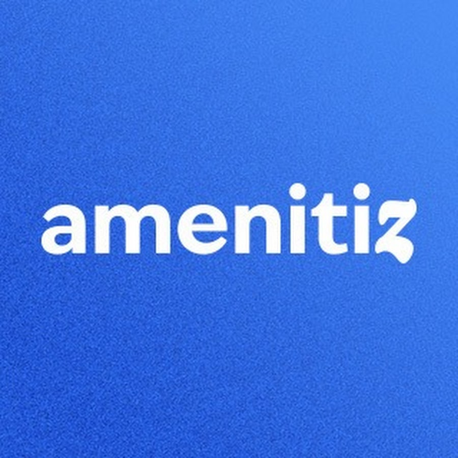</td>
    </tr>
    <tr>
      <td rowspan="2"><strong>Perfil</strong></td>
      <td>Overview</td>
      <td>Plataforma web moderna para gestión de reservas, huéspedes e inventario de habitaciones en hostales y pequeños hoteles, con foco en simplicidad, bajo costo y escalabilidad en LATAM.</td>
      <td>Software hotelero para hoteles boutique y medianos, con foco regional y funcionalidades básicas de gestión, reservas y reportes.</td>
      <td>PMS robusto orientado a hoteles medianos y grandes, con herramientas avanzadas de housekeeping, reportes e integraciones globales.</td>
      <td>Plataforma todo en uno que integra PMS, motor de reservas, channel manager y creador de páginas web, enfocada en pequeños hoteles y B&Bs.</td>
    </tr>
    <tr>
      <td>Ventaja competitiva / Valor</td>
      <td>Accesible, fácil de usar, soporte cultural y regional para hostales en LATAM. Permite digitalizar procesos sin grandes inversiones.</td>
      <td>Experiencia consolidada en la región, solución confiable para hoteles boutique con mayor presupuesto.</td>
      <td>Escalabilidad, integraciones avanzadas y funcionalidades completas para cadenas y hoteles de gran operación.</td>
      <td>Simplicidad, solución integral y rápida adopción, con fuerte enfoque en reservas directas y digitalización rápida.</td>
    </tr>
    <tr>
      <td rowspan="2"><strong>Perfil de Marketing</strong></td>
      <td>Mercado objetivo</td>
      <td>Hostales y pequeños hoteles independientes con menos de 30 habitaciones en LATAM, que operan aún con sistemas manuales.</td>
      <td>Hoteles pequeños y medianos (20–100 habitaciones) en zonas turísticas de LATAM.</td>
      <td>Hoteles medianos y grandes (50+ habitaciones), cadenas hoteleras y resorts.</td>
      <td>Pequeños hoteles, hostales y B&Bs (menos de 50 habitaciones) en Europa y LATAM.</td>
    </tr>
    <tr>
      <td>Estrategias de marketing</td>
      <td>Marketing digital segmentado, alianzas con asociaciones de turismo, y modelo freemium para captar pequeños hostales.</td>
      <td>Ferias de turismo, alianzas con cámaras hoteleras, marketing B2B directo.</td>
      <td>Presencia en ferias internacionales, alianzas con cadenas hoteleras, promoción en medios especializados.</td>
      <td>Marketing digital intensivo, inbound con tutoriales y casos de éxito, fuerte presencia en redes sociales.</td>
    </tr>
    <tr>
      <td rowspan="3"><strong>Perfil de Producto</strong></td>
      <td>Productos & Servicios</td>
      <td>Gestión de reservas, huéspedes, inventario, reportes básicos, soporte multicanal y conexión con OTAs.</td>
      <td>Motor de reservas online, gestión de ocupación, reportes financieros básicos e integración con Booking/Expedia.</td>
      <td>Gestión avanzada de reservas, housekeeping, reportes detallados, integraciones con OTAs y soporte multi-sucursal.</td>
      <td>PMS básico, motor de reservas directo, channel manager, creador de páginas web, facturación y pagos online.</td>
    </tr>
    <tr>
      <td>Precios & Costos</td>
      <td>Planes accesibles y flexibles según tamaño; orientado a pequeños negocios con bajo presupuesto.</td>
      <td>Suscripción mensual alta, escalada por habitaciones; costo adicional por integraciones.</td>
      <td>Precio elevado, suscripción mensual/anual por número de habitaciones; módulos premium aparte.</td>
      <td>Suscripción mensual accesible, escalada según servicios; sin grandes costos iniciales.</td>
    </tr>
    <tr>
      <td>Canales de distribución</td>
      <td>Plataforma web con soporte en español.</td>
      <td>Web responsive y app móvil limitada, SaaS directo.</td>
      <td>Plataforma web completa + app móvil para staff, SaaS.</td>
      <td>Web + app móvil básica, distribución online con onboarding guiado.</td>
    </tr>
    <tr>
      <td rowspan="4"><strong>Análisis SWOT</strong></td>
      <td>Fortalezas</td>
      <td>
        <ul>
          <li>Precios accesibles.</li>
          <li>Enfoque en hostales pequeños de LATAM.</li>
          <li>Plataforma simple y escalable.</li>
        </ul>
      </td>
      <td>
        <ul>
          <li>Presencia regional consolidada.</li>
          <li>Conexión con OTAs internacionales.</li>
        </ul>
      </td>
      <td>
        <ul>
          <li>Plataforma robusta y escalable.</li>
          <li>Integraciones con OTAs globales.</li>
        </ul>
      </td>
      <td>
        <ul>
          <li>Todo en uno (PMS + web + reservas).</li>
          <li>Fácil de usar y rápida adopción.</li>
        </ul>
      </td>
    </tr>
    <tr>
      <td>Debilidades</td>
      <td>
        <ul>
          <li>Menos funciones avanzadas.</li>
          <li>Menor presencia internacional.</li>
        </ul>
      </td>
      <td>
        <ul>
          <li>No apto para hostales pequeños.</li>
          <li>Precios altos.</li>
        </ul>
      </td>
      <td>
        <ul>
          <li>Costo elevado.</li>
          <li>Curva de aprendizaje alta.</li>
        </ul>
      </td>
      <td>
        <ul>
          <li>PMS limitado frente a opciones más robustas.</li>
          <li>Menos personalizable.</li>
        </ul>
      </td>
    </tr>
    <tr>
      <td>Oportunidades</td>
      <td>
        <ul>
          <li>Aprovechar la digitalización en LATAM.</li>
          <li>Captar segmento desatendido de micro-hoteles.</li>
        </ul>
      </td>
      <td>
        <ul>
          <li>Expansión a micro-hoteles.</li>
          <li>Crecimiento turístico regional.</li>
        </ul>
      </td>
      <td>
        <ul>
          <li>Versión ligera para pequeños hoteles.</li>
          <li>Demanda de soluciones integradas.</li>
        </ul>
      </td>
      <td>
        <ul>
          <li>Expansión en LATAM.</li>
          <li>Integrar nuevas tecnologías (IA, check-in online).</li>
        </ul>
      </td>
    </tr>
    <tr>
      <td>Amenazas</td>
      <td>
        <ul>
          <li>Competidores globales con mayor alcance.</li>
          <li>Expectativas de mayor sofisticación.</li>
        </ul>
      </td>
      <td>
        <ul>
          <li>Competencia de soluciones más baratas.</li>
          <li>Entrada de players globales.</li>
        </ul>
      </td>
      <td>
        <ul>
          <li>Competidores accesibles y simples.</li>
          <li>Mercado saturado de PMS.</li>
        </ul>
      </td>
      <td>
        <ul>
          <li>Competidores regionales más baratos.</li>
          <li>Falta de escalabilidad para clientes en crecimiento.</li>
        </ul>
      </td>
    </tr>
  </tbody>
</table>

### 2.1.2. Estrategias y tácticas frente a competidores

Para destacar frente a competidores como Small Hotels Latin America, Samin PMS y Amenitiz y consolidar nuestra posición en el mercado de soluciones de gestión para hostales y pequeños hoteles, resulta imprescindible diseñar un conjunto de estrategias y tácticas coordinadas que refuercen la diferenciación de HostelManager, aumenten la adopción en LATAM y consoliden su escalabilidad.

1. Desarrollo de una Propuesta de Valor Distintiva

Estrategia:

Posicionar a HostelManager como el PMS más simple y económico para hoteles y hostales de LATAM, ofreciendo en una sola plataforma las funciones esenciales (reservas, gestión de huéspedes, facturación y calendario de disponibilidad), sin necesidad de soporte externo ni configuraciones complejas.

Tácticas:

- Entrevistas con administradores para identificar problemas clave (sobreventa, errores, pagos).

- Encuestas masivas para validar funciones mínimas necesarias.

- Pruebas A/B en landing pages con mensajes directos.

- Videos cortos demostrativos.

- Testimonios de clientes piloto.

Indicadores de éxito:

- Conversión en landing pages ≥ 12 %.

- Valor percibido en encuestas ≥ 4.3/5.

- Engagement en videos ≥ 40 % visualización.

2. Optimización de la Experiencia de Usuario (UX)

Estrategia:

Diseñar una plataforma intuitiva y práctica que no requiera asistencia externa, garantizando que cualquier administrador pueda aprender a usarla en pocos minutos.

Tácticas:

- Flujos simples para tareas críticas (reservas, check-in, facturación).

- Testeo con usuarios sin experiencia en 3 rondas.

- Medición de errores y tiempos para mejorar la interfaz.

Indicadores de éxito:

- SUS (System Usability Scale) > 80.

- Tasa de error en tareas clave < 10 %.

- Tiempo de check-in ≤ 2 minutos.

3. Expansión de la Base de Usuarios

Estrategia:

Iniciar con hostales independientes de bajo presupuesto en LATAM y luego expandirse a pequeños hoteles familiares y B&B urbanos.

Tácticas:

- Flujos simples para tareas críticas (reservas, check-in, facturación).

- Testeo con usuarios sin experiencia en 3 rondas.

- Medición de errores y tiempos para mejorar la interfaz.

Indicadores de éxito:

- Conversión de freemium a suscripción ≥ 18 %.

- Penetración inicial en segmento hostales ≥ 10 % en 6 meses.

- Tasa de referidos ≥ 20 %.

4. Marketing Digital de Alta Precisión

Estrategia:

Atraer administradores mediante campañas enfocadas en simplicidad y bajo costo, sin prometer soporte extra.

Tácticas:

- Publicidad en Facebook, Instagram y Google Ads.

- Retargeting para visitantes no convertidos.

- Casos de éxito en formatos visuales (videos, carruseles).

Indicadores de éxito:

- ROAS ≥ 3.5x.

- CPA ≤ S/ 45.

- CTR en anuncios de video ≥ 2.5 %.

5. Alianzas Comerciales y Cooperaciones Estratégicas

Estrategia:

Aumentar la visibilidad y adopción de HostelManager mediante convenios con actores del ecosistema turístico y educativo.

Tácticas:

- Convenios con asociaciones y cámaras de turismo.

- Alianzas con universidades y escuelas de hotelería.

- Participación en ferias y eventos.

- Programa de comisiones para consultores.

Indicadores de éxito:

- ≥ 15 alianzas estratégicas en el primer año.

- Ventas vía alianzas ≥ 20 % del total.

- Conversión en eventos ≥ 30 % de asistentes interesados.

## 2.2. Entrevistas
### 2.2.1. Diseño de entrevistas

Con el fin de comprender a profundidad las necesidades, problemas y expectativas de nuestros usuarios potenciales, hemos realizado entrevistas a administradores de hoteles y huéspedes que se hospedan en establecimientos de mediana y pequeña escala.

Para ello, les planteamos una serie de preguntas generales y específicas que nos permiten mapear su contexto, hábitos, experiencias previas y nivel de disposición hacia soluciones como nuestro sistema de gestión digital.

Administradores de hoteles (pequeños y medianos).

a) Preguntas Generales
- ¿Cómo se llama su establecimiento y cuántas habitaciones administran?

- ¿Cuál es su rol dentro del hostal/hotel?

- ¿Actualmente cómo gestionan las reservas, check-in, check-out y servicios adicionales?

- ¿Qué métodos de pago ofrecen a sus clientes?

- ¿Han usado antes algún sistema digital para gestión? ¿Qué les gustó y qué no?

b) Preguntas Específicas

- ¿Cuáles son los principales problemas que enfrentan en la administración diaria (errores en reservas, pagos, comunicación, etc.)?

- ¿Qué tan importante es para usted contar con reportes de ocupación, ingresos y satisfacción de clientes?

- ¿Le resultaría útil contar con una plataforma que integre en un solo lugar reservas, pagos y comunicación con clientes?

- Si tuviera un sistema que enviará notificaciones automáticas (ej. recordatorios de pago o llegada de clientes), ¿lo usaría?

- ¿Qué tan dispuesto estaría a pagar una suscripción mensual por un sistema que le ahorre tiempo y evite pérdidas económicas?

- ¿Qué funcionalidades considera más críticas para su negocio (control de habitaciones, facturación digital, integración con pasarelas de pago, etc.)?

- ¿Cuánto tiempo diario invierte en la gestión manual de su hostal/hotel y cuánto le gustaría reducirlo?

- ¿Le sería útil un sistema que le muestre estadísticas de temporadas altas y bajas para planificar precios?

Huéspedes de hoteles

a) Preguntas Generales

- ¿Cómo te llamas y cuántos años tienes?

- ¿Qué tan seguido te hospedas en hoteles/hostales (viajes de estudio, trabajo, turismo)?

- ¿Cómo sueles buscar y reservar hospedajes (apps, webs, agencias, redes sociales)?

- ¿Qué dispositivos utilizas más para buscar hospedajes (celular, laptop, tablet)?

-¿Qué factores consideras más importantes al elegir un hospedaje (precio, ubicación, reseñas, servicios)?

b) Preguntas Específicas

-¿Has tenido alguna vez problemas con reservas manuales (ej. confusión al llegar, reservas no registradas)?

-¿Qué tan importante es para ti poder reservar, pagar y solicitar servicios desde el celular sin llamadas o papeleo?

-¿Qué servicios adicionales valoras más al hospedarte (desayuno, limpieza, lavandería, transporte, WiFi)?

- ¿Qué tan útil te parecería que un sistema te confirme en tiempo real tu reserva y pago?

- ¿Te gustaría recibir notificaciones automáticas con información de tu reserva, horarios de check-in y promociones?

- ¿Qué canales digitales usas para validar la confianza de un hotel (reseñas en Google, Booking, Instagram, TikTok)?

- ¿Qué fue lo que más te frustró en tu última experiencia de hospedaje y qué te gustaría que mejorara?

- ¿Qué tan importante sería para ti poder chatear con el hotel directamente por la app antes y durante tu estancia?

- ¿Si tuvieras que recomendar un hospedaje a un amigo, qué aspecto debería destacar para que lo recomiendes?

- ¿Qué tanto confiarías en un sistema digital que centraliza todo (reserva, pago y comunicación con el hotel) en un solo lugar?

### 2.2.2. Registro de entrevistas

Segmento Objetivo 1: Administrador/a

Entrevista N1:

* **Nombre y apellidos:** Jakeline Gutierrez 
  * **Edad:** 36 años
  * **Departamento:** Ayacucho
  * **Ocupación:** Administradora de hostel   
  * **Tiempo de Entrevista:** 3 minutos con 02 segundos
  * **Inicio de Entrevista:** 0:00
  * **Final de Entrevista:** 3:02

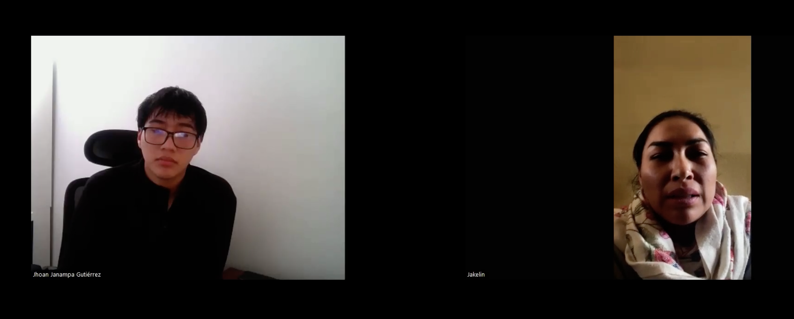

* **Resumen De Entrevista**

Jalkelin explicó que administra el hostal Nogales en Ayacucho con 15 habitaciones. Maneja las reservas manualmente en un cuaderno y coordina algunas por WhatsApp. Los métodos de pago más comunes son efectivo y transferencias por Yape/Plin. Nunca ha usado un sistema digital de gestión.
Mencionó que los problemas principales son las reservas duplicadas y la falta de control de pagos cuando los clientes llegan por diferentes canales. Dedica entre 3 y 4 horas diarias a la gestión, y desearía reducirlo a menos de 1 hora con ayuda de un sistema digital. Considera críticas funciones como control de habitaciones, facturación digital, integración con pagos con tarjeta y reportes de temporadas altas/bajas. Estaría dispuesta a pagar aproximadamente S/100 mensuales si el sistema realmente le ahorra tiempo y pérdidas.

**Link:** https://url-shortener.me/4UMU

---

Entrevista N2:

* **Nombre y apellidos:** Heydi Janampa Silva
  * **Edad:** 35 años
  * **Departamento:** Ayacucho
  * **Ocupación:** Administradora de hostel   
  * **Tiempo de Entrevista:** 4 minutos con 37 segundos
  * **Inicio de Entrevista:** 0:00
  * **Final de Entrevista:** 4:37 min

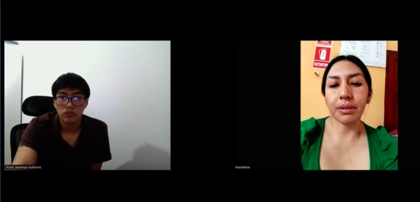

* **Resumen De Entrevista**

Resumen: Heydi explicó que administra el hospedaje Sueño Dorado en Ayacucho, el cual cuenta con 25 habitaciones. Actualmente maneja las reservas de manera manual en un cuaderno y también coordina algunas a través de WhatsApp. Los métodos de pago más comunes entre sus huéspedes son efectivo y transferencias por Yape/Plin. Comentó que nunca ha utilizado un sistema digital de gestión.
Entre los principales problemas mencionó las reservas duplicadas y la falta de control en los pagos, especialmente cuando los clientes llegan por diferentes canales como Booking o redes sociales. Dijo que dedica entre 3 y 4 horas diarias a la gestión administrativa, y le gustaría reducir ese tiempo a menos de 1 hora con ayuda de un sistema digital.
Respecto a las funciones que considera más importantes, destacó el control de habitaciones, la facturación digital, la integración con pagos con tarjeta y los reportes de temporadas altas/bajas para planificar mejor sus precios. Aunque no supo precisar cuánto estaría dispuesta a pagar por un sistema de este tipo, aseguró que sí está interesada en implementarlo si le ofrece una solución práctica y confiable para mejorar la administración de su hospedaje.

**Link:** https://acortar.link/gFQKlK

---

Entrevista N3:

* **Nombre y apellidos:** José Luis Carranza Gastelo
  * **Edad:** 35 años
  * **Departamento:** Cajamarca
  * **Ocupación:** Administrador de Hotel  
  * **Tiempo de Entrevista:** 6 minutos con 20 segundos
  * **Inicio de Entrevista:** 0:00
  * **Final de Entrevista:** 6:20 min

* **Resumen De Entrevista**

Resumen: José Carranza menciona que es dueño y administrador de un Hotel de 15 habitaciones llamado “Hotel Cutervo” en la ciudad de Cutervo en Cajamarca. Menciona que las reservas y la gestión general del hotel las hace mediante un cuaderno de notas y redes sociales como Whatsapp, los métodos de pago que usa son las billeteras digitales como Yape.

Menciona que le es muy complicado administrar un hotel usando solamente métodos manuales, esto muchas veces le ha traído problemas ya que no puede llevar una buena contabilidad cuando trabaja. En términos generales, le toma mucho tiempo administrar y le gustaría que fuese todo más digitalizado para poder reducir costos y tiempos.

Las funcionalidades que él menciona gustaría que se implementen es poder realizar reservas de manera digital, el cual le ayudaría a llevar un control de la cantidad de huéspedes que se hospedan, fechas de entrada y salida más precisas. Le gustaría también una funcionalidad que le permita generar reportes detallados y estadísticas por temporadas, para poder así administrar de una mejor manera su hotel y evitar contratiempos.

**Link:** https://acortar.link/HERdbK

---

Entrevista N4:

* **Nombre y apellidos:** Milagro Del Castillo alvera
  * **Edad:** 22 años
  * **Departamento:**  Cusco
  * **Ocupación:** Administrador de Hotel  
  * **Tiempo de Entrevista:** 4 minutos con 52 segundos
  * **Inicio de Entrevista:** 0:00
  * **Final de Entrevista:** 4:52 min

* **Resumen De Entrevista**

Resumen: Milagro trabaja en un hotel ubicado en Megantoni, Cusco, una provincia algo alejada de las principales ciudades. El hotel, llamado Max, cuenta con 18 habitaciones. Actualmente, Milagro lleva el registro de manera manual, lo cual le consume tiempo, especialmente al calcular el monto total de las ganancias. Nos comenta que le gustaría contar con un programa que le facilite este proceso, además de permitirle generar reportes sobre la cantidad de personas que ingresan al hotel según la temporada. Ella estaría dispuesta a pagar por este servicio si le ayuda a reducir el tiempo que dedica al registro y a la contabilización de las ganancias.

**Link:** https://acortar.link/TrBNLa

---

Segmento Objetivo 2: Huesped de Hotel

Entrevista N5:

* **Nombre y apellidos:** María Yolanda Pérez Diaz 
  * **Edad:** 35 años
  * **Departamento:** Lima
  * **Ocupación:** Docente de primaria  
  * **Tiempo de Entrevista:** 6 minutos con 25 segundos
  * **Inicio de Entrevista:** 0:00
  * **Final de Entrevista:** 6:25 min

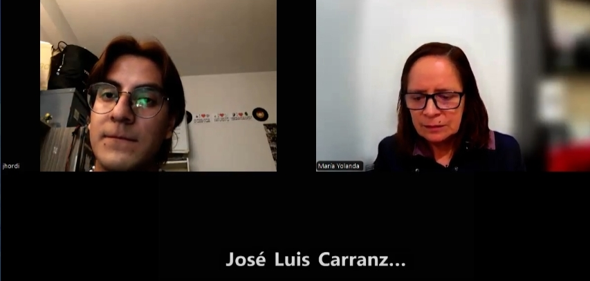

* **Resumen De Entrevista**

Resumen: María Yolanda explica que suele viajar en épocas de vacaciones o temporadas variadas, busca hoteles mediante redes sociales y mediante recomendaciones de amistades.

Menciona que la principal complicación que tiene es que se le es muy complicado hacer una reserva en el momento, muchas veces ha tenido problemas con ello o al momento de hacer el checking.

Le gustaría que se implementaran funcionalidades tales como poder realizar reservas desde la comodidad de su casa, para así evitar largas esperas y costos innecesarios. En general que todo sea más digital y automatizado.

**Link:** https://acortar.link/kpEQW0

---

Entrevista N6:

* **Nombre y apellidos:** Franklin ochoa
  * **Edad:** 21 años
  * **Departamento:** Lima
  * **Ocupación:** Estudiante universitario  
  * **Tiempo de Entrevista:** 7 minutos con 41 segundos
  * **Inicio de Entrevista:** 0:00
  * **Final de Entrevista:** 7:41 min

* **Resumen De Entrevista**

Resumen: Franklin explicó que mayormente viaja por turismos y que según él busca hoteles según la ubicación y recomendaciones que encuentra en las redes, mayormente busca hoteles desde su celular y laptop.

Según franklin le gusta que los hoteles higiénicos, además la hospitalidad del hotel. Mayormente franklin busca los hospedajes por las recomendaciones que encuentre en su página, además revisa todas las redes sociales que tiene el hotel.

Nos comentó que si le gustaría tener un sistema que le facilite las reservas, también quiere saber los detalles de la reserva y tener el contacto con la administradora del hotel para saber si por algún inconveniente le cancelan la reserva .

**Link:** https://acortar.link/gpGcJY

### 2.2.3. Análisis de entrevistas

### Análisis de Entrevistas: Administradores de Hoteles

#### Contexto y Características Comunes

- **Tamaño y tipo de los establecimientos**: Los administradores entrevistados están a cargo de pequeños establecimientos, la mayoría con entre 15 y 25 habitaciones.
- **Métodos de gestión**: Predomina la gestión manual, especialmente a través de cuadernos y WhatsApp. Ninguno de los entrevistados ha utilizado un sistema digital para la gestión.
- **Métodos de pago**: Los métodos más comunes son efectivo y billeteras electrónicas como Yape/Plin, lo que sugiere una preferencia por pagos rápidos y directos, sin necesidad de tarjetas.
- **Problemas comunes**: Los problemas recurrentes mencionados incluyen la duplicación de reservas, falta de control en los pagos, y dificultad para gestionar la información dispersa (por ejemplo, reservas hechas por WhatsApp y otras plataformas).

#### Problemas Identificados

- **Gestión manual y falta de control**: Todos los administradores expresaron que la gestión manual es ineficiente y propensa a errores, como reservas duplicadas o la pérdida de información clave.
- **Tiempo invertido en la gestión**: Los administradores mencionaron que dedican entre 3 y 4 horas diarias a la gestión manual, un tiempo que desearían reducir a menos de 1 hora mediante el uso de un sistema digital.
- **Necesidad de centralización de procesos**: La mayoría mostró un fuerte interés en tener un sistema que integre reservas, pagos y comunicación con los clientes en una sola plataforma. Esto sería clave para evitar los errores derivados de múltiples canales.

#### Expectativas sobre el Sistema Digital

##### Funcionalidades clave:
- **Control de habitaciones**: Fundamental para evitar duplicaciones y pérdidas.
- **Facturación digital**: Crucial para simplificar los pagos y mejorar la contabilidad.
- **Integración con métodos de pago (especialmente Yape/Plin) y tarjetas**: Para facilitar las transacciones y evitar complicaciones.
- **Reportes de ocupación y estadísticas por temporadas**: Esto permitiría a los administradores ajustar precios según la demanda y optimizar los ingresos.

- **Disposición a pagar**: Los administradores están dispuestos a pagar una suscripción mensual que ronde los S/100 si el sistema les ahorra tiempo y mejora la eficiencia.

#### Resumen y Oportunidades de Mejora

- **Falta de sistemas digitales**: Hay una oportunidad clara para introducir un sistema de gestión digital fácil de usar que permita centralizar la información y automatizar tareas.
- **Interés en la simplificación**: Los administradores necesitan herramientas que les ayuden a reducir el tiempo de gestión y minimizar los errores humanos. La integración con sistemas de pago actuales y la automatización de notificaciones son características valoradas positivamente.

---

### Análisis de Entrevistas: Huéspedes de Hoteles

#### Contexto y Características Comunes

- **Motivos de viaje**: Los huéspedes consultados viajan principalmente por turismo y vacaciones, aunque algunos también lo hacen por trabajo o estudios.
- **Métodos de reserva**: La mayoría de los huéspedes buscan y reservan alojamiento a través de redes sociales, apps, y recomendaciones de amigos.
- **Dispositivos de búsqueda**: El celular es el dispositivo más utilizado para realizar reservas, seguido de cerca por las laptops.

#### Problemas y Necesidades Identificadas

- **Problemas con reservas manuales**: Algunos huéspedes mencionaron dificultades al realizar reservas manuales o problemas al llegar al hotel, como reservas no registradas o confusión con la disponibilidad.
- **Importancia de la digitalización**: Los huéspedes valoran la capacidad de hacer reservas de manera autónoma y rápida, sin tener que realizar llamadas telefónicas o enfrentarse a papeleo innecesario.
- **Valoración de la facilidad de pago**: Quieren poder reservar, pagar y solicitar servicios directamente desde su celular, lo que les ahorra tiempo y evita posibles inconvenientes.
- **Comunicación directa con el hotel**: Los huéspedes expresaron que sería útil poder chatear directamente con el hotel para resolver dudas o confirmar detalles de la reserva.

#### Expectativas sobre el Sistema Digital

- **Confirmación en tiempo real**: Los huéspedes valoran la confirmación instantánea de sus reservas y pagos, lo que les genera confianza en el proceso.
- **Notificaciones automáticas**: Están interesados en recibir notificaciones automáticas sobre su reserva, horarios de check-in y promociones.
- **Confianza digital**: Algunos huéspedes mencionaron que confían en reseñas y redes sociales para validar la reputación del hotel. Un sistema que centralice todo el proceso (reserva, pago y comunicación) en una sola plataforma les parecería conveniente y confiable.

#### Resumen y Oportunidades de Mejora

- **Facilidad de uso**: Los huéspedes desean un sistema que les permita realizar todo el proceso de manera sencilla, rápida y segura, desde la búsqueda de alojamiento hasta el pago y la comunicación con el hotel.
- **Automatización y notificaciones**: La implementación de notificaciones automáticas es una oportunidad clave para mejorar la experiencia del usuario, especialmente si el sistema permite un seguimiento continuo y notificaciones sobre cualquier cambio.

---

### Conclusiones Generales

- **Para los Administradores**: Existe una fuerte necesidad de sistemas de gestión digital que puedan centralizar reservas, pagos y comunicaciones. Además, los administradores valoran profundamente las herramientas de facturación digital y la posibilidad de obtener reportes de ocupación y estadísticas.
- **Para los Huéspedes**: La demanda de una experiencia digital simplificada es clara, desde la reserva hasta la comunicación con el hotel. Los huéspedes buscan sistemas que les permitan hacer todo el proceso de forma eficiente desde su celular, con notificaciones automáticas y sin complicaciones.

## 2.3. Needfinding

En esta sección presentamos los artefactos generados a partir del análisis exhaustivo de la información recopilada en las entrevistas: perfiles de User Personas, User Task Matrix, User Journey Maps, Empathy Mapping y As-Is Scenario Mapping. Cada uno de estos elementos refleja las necesidades, motivaciones y puntos de dolor identificados, y sirve como base para definir soluciones de diseño centradas en el usuario. Al mostrar estos entregables, buscamos asegurar que todas las decisiones de producto se fundamenten en datos cualitativos sólidos y en una comprensión profunda de los comportamientos reales de nuestros usuarios.

### 2.3.1. User Personas

En esta sección presentamos la construcción de las fichas de User Persona para los dos segmentos clave de nuestro proyecto: administradores de hostales y huéspedes. Estas fichas se basan en un análisis detallado de los comportamientos, necesidades y desafíos típicos de cada grupo, combinando información demográfica y psicográfica para comprender mejor sus expectativas. Esto nos permite orientar el diseño de Hostel Manager hacia funcionalidades que faciliten la gestión eficiente para los administradores y una experiencia digital fluida y satisfactoria para los huéspedes.

#### Segmento Objetivo: Administrador/a

#### Segmento Objetivo: Huesped

### 2.3.2. User Task Matrix

El User Task Matrix nos permite identificar las acciones clave que realizan los administradores de hostales y los huéspedes durante su experiencia de gestión u hospedaje, sin suponer aún la existencia de una solución digital. A través de esta matriz, analizamos cada tarea según su frecuencia y nivel de importancia, lo cual nos permite priorizar funcionalidades en Hostel Manager que respondan directamente a los procesos más críticos y frecuentes para cada segmento, asegurando así un diseño funcional alineado con sus necesidades reales.

#### Segmento Objetivo: Administrador/a

| Actividades                                               | Frecuencia | Importancia |
|-----------------------------------------------------------|------------|-------------|
| Gestionar reservas y disponibilidad de habitaciones       | Alta       | Alta        |
| Realizar check-in y check-out de huéspedes                | Alta       | Alta        |
| Generar reportes de ingresos y ocupación                  | Media      | Alta        |
| Coordinar servicios adicionales (desayunos, limpieza, lavandería) | Media      | Media       |
| Configurar precios y promociones                          | Media      | Alta        |
| Gestionar pagos y emitir comprobantes                     | Alta       | Alta        |
| Atender consultas y solicitudes de huéspedes              | Alta       | Media       |
| Revisar reseñas y feedback de huéspedes                   | Media      | Media       |

#### Segmento Objetivo: Huesped

| Actividades                                                          | Frecuencia | Importancia |
|----------------------------------------------------------------------|------------|-------------|
| Buscar y comparar hostales/hoteles en la web                         | Alta       | Alta        |
| Realizar reserva online                                              | Alta       | Alta        |
| Hacer check-in web antes o al llegar                                 | Media      | Alta        |
| Realizar pago online y recibir comprobante digital                   | Alta       | Alta        |
| Consultar servicios adicionales (ej: desayuno, tours, lavandería)    | Media      | Media       |
| Solicitar servicios extra desde la web                               | Media      | Media       |
| Revisar fotos, reseñas y detalles prácticos (Wi-Fi, horarios)        | Alta       | Alta        |
| Dejar reseña o compartir experiencia                                 | Baja       | Media       |
| Descargar o guardar factura digital para sus gastos                  | Baja       | Alta        |

### 2.3.3. User Journey Mapping

Aquí se presentan los User Journey Maps para cada uno de nuestros User Personas, mostrando el recorrido actual que realizan tanto los administradores como los huéspedes al gestionar o acceder a servicios de un hostal. Analizamos cada etapa del proceso, desde la reserva hasta la solicitud de servicios y el check-out, identificando puntos de fricción y oportunidades de mejora. Esta visualización nos permite diseñar flujos más eficientes y una experiencia centrada en el usuario.

### Segmento Objetivo : Productor

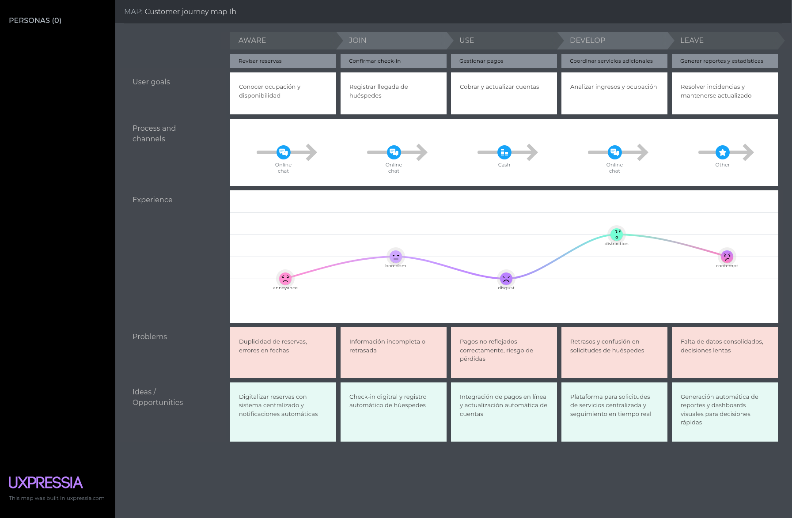

### Segmento Objetivo : Huesped

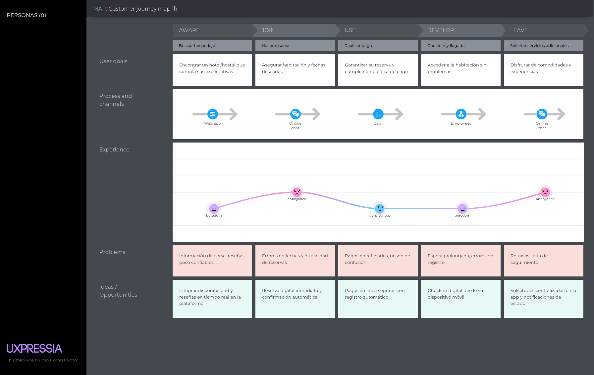

### 2.3.4. Empathy Mapping

En esta sección se describen el proceso y los resultados de los Empathy Maps desarrollados para cada User Persona definida previamente. A partir de la información recopilada en entrevistas y análisis del contexto, organizamos las observaciones en seis áreas clave:

- ¿Qué ve?

- ¿Qué dice?

- ¿Qué hace?

- ¿Qué escucha?

- ¿Qué piensa?

- ¿Qué siente?

Luego, identificamos los principales Pains (frustraciones y obstáculos) y Gains (motivaciones y necesidades) para comprender en profundidad la experiencia del usuario. Este ejercicio nos permite diseñar soluciones más alineadas con sus expectativas, comportamientos y emociones.

### Segmento Objetivo : Productor

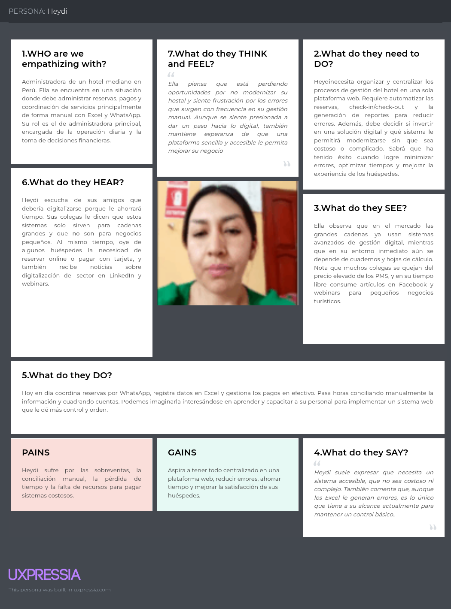

### Segmento Objetivo : Huesped

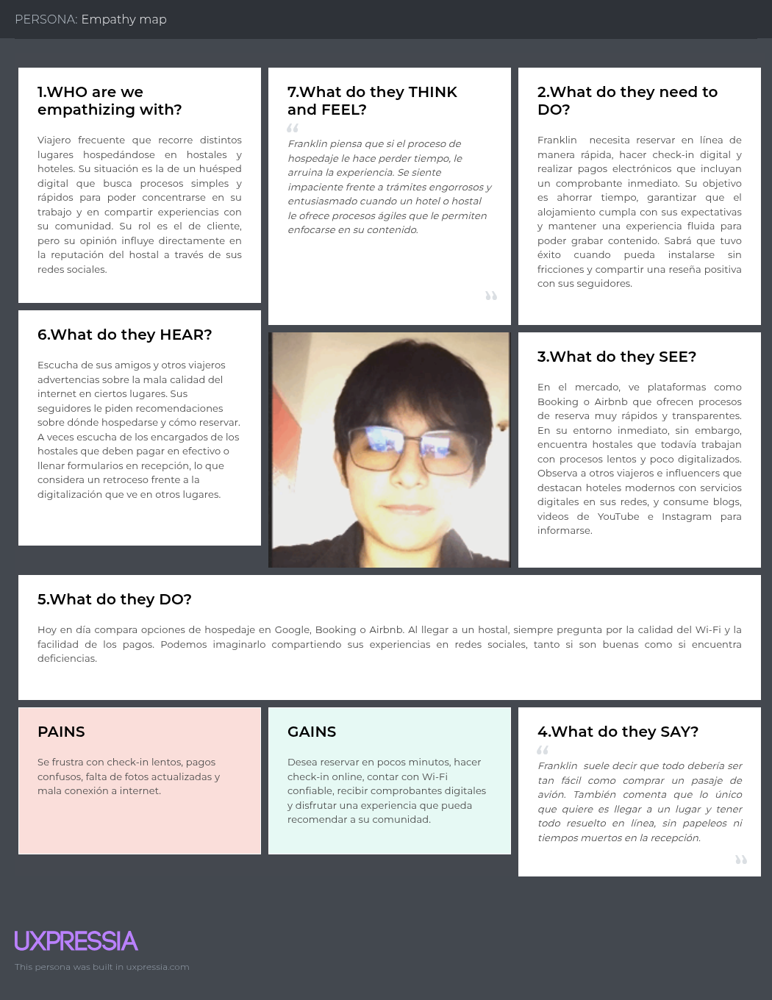

## 2.4. Big Picture EventStorming

En esta sección se realiza el Event Storming, una técnica colaborativa y visual utilizada para explorar y modelar los procesos de negocio de nuestro sistema propuesto. A través de la identificación y discusión de los eventos clave que ocurren en el dominio, se busca comprender de manera integral cómo los diferentes componentes interactúan entre sí, las reglas que los gobiernan y las posibles áreas de mejora.

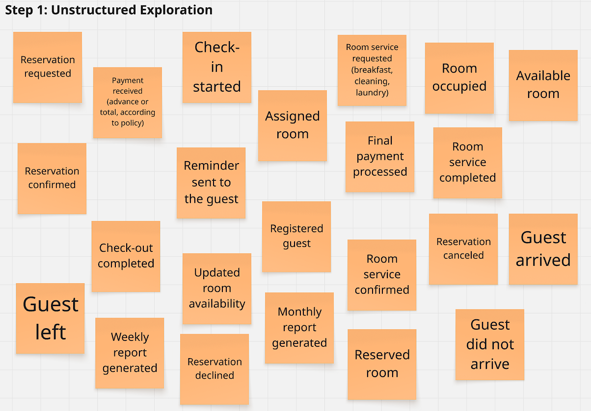

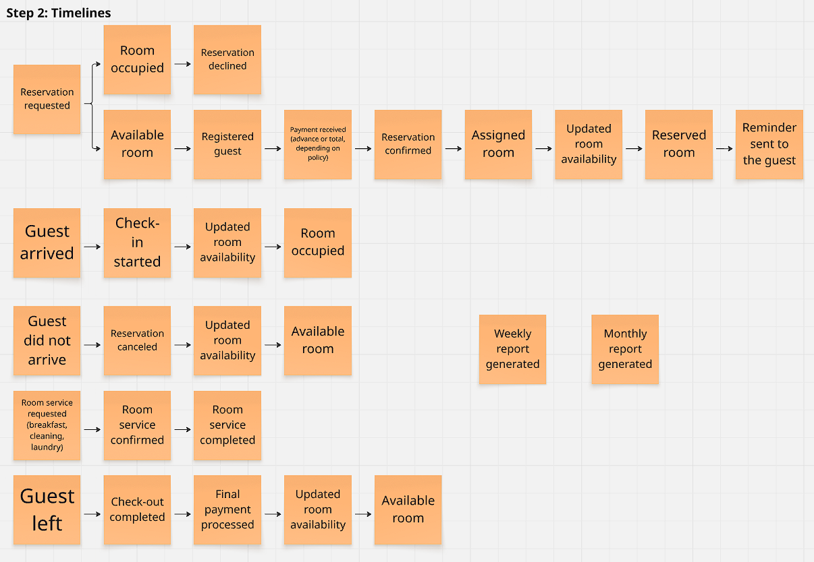

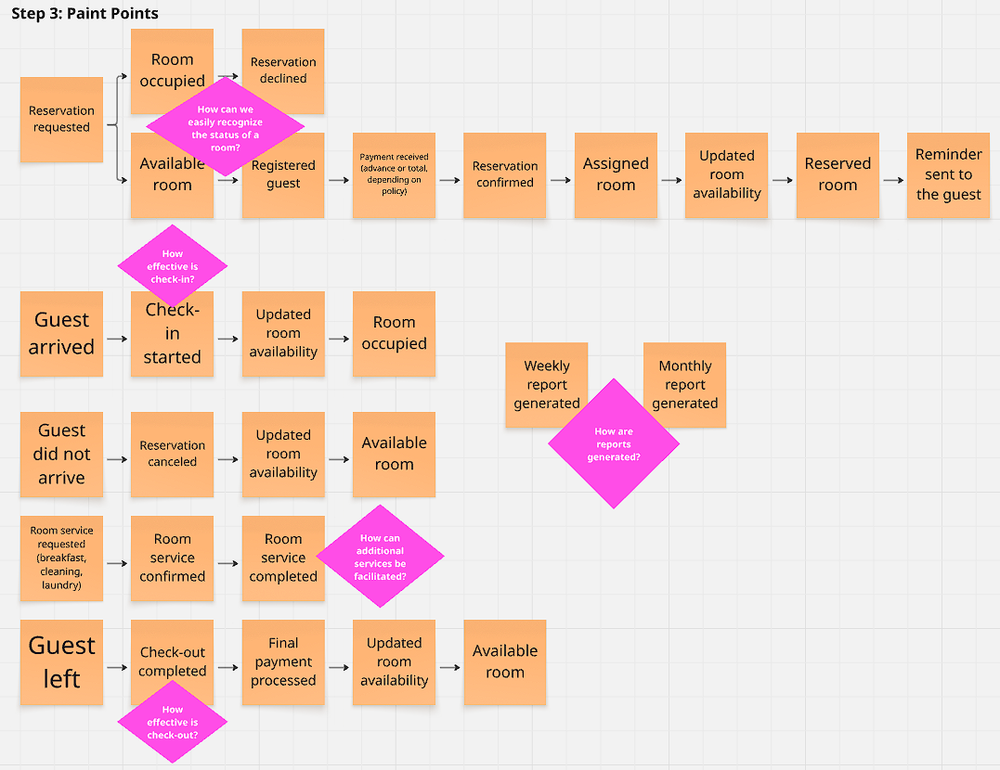

## 2.5. Ubiquitous Language

En esta sección presentamos el glosario de Lenguaje Ubicuo, conformado por los términos clave del dominio de la gestión hotelera independiente utilizados en Hostel Manager. Cada término está escrito en inglés, con su equivalente en español entre paréntesis, y acompañado de una definición clara y específica. Este glosario busca garantizar que todos los miembros del equipo —desde desarrolladores hasta stakeholders— compartan un entendimiento común y sin ambigüedades, facilitando así la comunicación efectiva durante todo el ciclo de vida del proyecto. El Lenguaje Ubicuo se enfoca exclusivamente en conceptos del dominio del negocio, excluyendo jerga técnica de ingeniería de software.

| **Term**                                   | **Definición**                                                                                                                                                                |
| ------------------------------------------ | ----------------------------------------------------------------------------------------------------------------------------------------------------------------------------- |
| **Administrator**                          | Persona encargada de gestionar un hostal o pequeño hotel. Es el usuario principal de la plataforma Hostel Manager. Puede ser el propietario o un trabajador asignado.         |
| **Guest**                                  | Cliente que se aloja en el establecimiento. Su experiencia debe ser fluida, rápida y digitalizada, desde la reserva hasta el check-out.                                       |
| **Reservation**                            | Proceso por el cual un huésped solicita y asegura una habitación. Puede ser realizada manualmente o a través de canales digitales.                                            |
| **Check-in / Check-out**                   | Proceso de entrada/salida del huésped. Hostel Manager permite automatizar este flujo con formularios digitales, notificaciones y validación de identidad.                     |
| **Overbooking**                            | Error en la gestión de reservas que genera múltiples asignaciones para una misma habitación en el mismo periodo. Uno de los principales problemas que resuelve la plataforma. |
| **Availability**                           | Estado de ocupación de las habitaciones. La plataforma gestiona esta información en tiempo real para evitar errores.                                                          |
| **Additional Services**                    | Productos o servicios complementarios al hospedaje, como desayuno, lavandería, tours, transporte, etc. También se gestionan desde la plataforma.                              |
| **Payment Gateway**                        | Sistema que permite recibir pagos de forma electrónica, segura y eficiente. Se integra con Hostel Manager para transacciones online o presenciales.                           |
| **MRR (Monthly Recurring Revenue)**        | Ingreso mensual recurrente derivado del modelo de suscripción de Hostel Manager.                                                                                              |
| **Churn Rate**                             | Porcentaje de clientes que cancelan su suscripción en un periodo determinado. Indicador clave de retención.                                                                   |
| **Dashboard**                              | Interfaz principal donde el administrador visualiza el estado del hostal, reservas, pagos y reportes clave.                                                                   |
| **Dynamic Reports**                        | Informes generados automáticamente por la plataforma, que permiten visualizar métricas como ocupación, ingresos, desempeño del personal, etc.                                 |
| **Monthly Subscription**                   | Modelo de negocio basado en pagos periódicos que da acceso al sistema y a sus funcionalidades.                                                                                |
| **Intuitive**                              | Diseño de interfaz amigable y fácil de usar, que requiere poca o ninguna capacitación técnica para operar.                                                                    |
| **Automation**                             | Eliminación de tareas manuales mediante procesos digitales que se ejecutan de forma autónoma o programada.                                                                    |
| **Automated Notifications**                | Mensajes enviados automáticamente al huésped o administrador para confirmar reservas, recordar pagos, etc.                                                                    |
| **Reviews/Ratings**                        | Comentarios dejados por los huéspedes después de su estadía, visibles en el módulo de retroalimentación.                                                                      |
| **Independent Hostel/Lodging**             | Establecimiento de alojamiento pequeño o mediano, que no forma parte de una cadena hotelera. Público objetivo principal de Hostel Manager.                                    |
| **Online Check-in**                        | Proceso digital que permite al huésped registrarse antes de llegar, agilizando su ingreso al hostal.                                                                          |
| **FAQs**                                   | Sección de preguntas frecuentes que ayuda al administrador a resolver dudas sin necesidad de contactar soporte.                                                               |
| **CRM (Customer Relationship Management)** | Sistema que gestiona la relación con clientes, usado en Hostel Manager para seguimiento de huéspedes y administración de contactos.                                           |

# Capítulo III: Requirements Specification

## 3.1. User Stories

### Epics

<table>
  <thead>
    <tr>
      <th>Epic ID</th>
      <th>Título</th>
      <th>Descripción (Como / Quiero / Para que)</th>
    </tr>
  </thead>
  <tbody>
    <tr><td>EP01</td><td>Gestión de Reservas</td><td>Como administrador de un hostal quiero gestionar todo el ciclo de reservas (búsqueda, creación, cambios y cancelaciones) para reducir errores y optimizar la ocupación.</td></tr>
    <tr><td>EP02</td><td>Operación de Huéspedes</td><td>Como administrador quiero controlar check-in, check-out y el historial de cada huésped para ofrecer un servicio rápido y personalizado.</td></tr>
    <tr><td>EP03</td><td>Servicios y Experiencia</td><td>Como huésped quiero solicitar y pagar servicios adicionales en tiempo real para que mi estadía sea más cómoda y completa.</td></tr>
    <tr><td>EP04</td><td>Administración Financiera</td><td>Como administrador quiero registrar pagos, generar facturas y obtener reportes para mantener un control financiero confiable.</td></tr>
    <tr><td>EP05</td><td>Plataforma y Acceso Seguro</td><td>Como usuario quiero autenticarme y acceder desde cualquier dispositivo para que mis datos estén protegidos y pueda operar en todo momento.</td></tr>
    <tr><td>EP06</td><td>Marketing y Captación</td><td>Como visitante o potencial cliente quiero conocer la propuesta de valor, planes y testimonios en una landing page para decidir registrarme o solicitar más información.</td></tr>
    <tr><td>EP07</td><td>API Pública e Integraciones</td><td>Como desarrollador externo quiero consumir una API RESTful de reservas, pagos y usuarios para integrar Hostel Manager con otros sistemas o aplicaciones.</td></tr>
  </tbody>
</table>

### User Stories

> Cada historia incluye dos escenarios de aceptación en formato **Given–When–Then**.

<table>
  <thead>
    <tr>
      <th>ID</th>
      <th>Título</th>
      <th>Descripción</th>
      <th>Criterios de Aceptación (2 escenarios)</th>
      <th>Epic</th>
    </tr>
  </thead>
  <tbody>
    <tr>
      <td>US01</td>
      <td>Buscar disponibilidad</td>
      <td>Como huésped quiero consultar habitaciones libres por fecha para planificar mi viaje.</td>
      <td>
        Escenario 1: Dado fechas válidas, cuando solicita disponibilidad, entonces el sistema muestra habitaciones. 
        Escenario 2: Dado rango invertido, cuando solicita disponibilidad, entonces el sistema informa “Fechas no válidas”.
      </td>
      <td>EP01</td>
    </tr>
    <tr>
      <td>US02</td>
      <td>Crear reserva</td>
      <td>Como administrador quiero registrar una reserva con datos de huésped y habitación para asegurar la disponibilidad.</td>
      <td>
        Escenario 1: Dado que ingresa datos válidos, cuando confirma, entonces el sistema guarda la reserva y confirma. 
        Escenario 2: Dado que la habitación está ocupada, cuando intenta reservar, entonces el sistema muestra “No disponible”.
      </td>
      <td>EP01</td>
    </tr>
    <tr>
      <td>US03</td>
      <td>Modificar reserva</td>
      <td>Como administrador quiero actualizar las fechas o datos de una reserva para mantener la información correcta.</td>
      <td>
        Escenario 1: Dado que la reserva está activa, cuando modifica fechas, entonces el sistema valida y guarda cambios. 
        Escenario 2: Dado que las nuevas fechas se superponen, cuando guarda, entonces el sistema muestra “Conflicto de fechas”.
      </td>
      <td>EP01</td>
    </tr>
    <tr>
      <td>US04</td>
      <td>Cancelar reserva</td>
      <td>Como administrador quiero cancelar reservas confirmadas para liberar la habitación.</td>
      <td>
        Escenario 1: Dado que selecciona una reserva activa, cuando confirma, entonces el sistema marca la reserva como cancelada  
        Escenario 2: Dado que la reserva ya está cancelada, cuando intenta cancelarla, entonces el sistema indica “Reserva ya cancelada”.
      </td>
      <td>EP01</td>
    </tr>
    <tr>
      <td>US05</td>
      <td>Reserva en línea</td>
      <td>Como huésped quiero crear y pagar una reserva desde mi dispositivo para obtener confirmación inmediata.</td>
      <td>
        Escenario 1: Dado que ingresa datos válidos y método de pago, cuando confirma, entonces el sistema registra la reserva y envía confirmación.  
        Escenario 2: Dado que el pago falla, cuando intenta reservar, entonces el sistema notifica “Transacción no completada”.
      </td>
      <td>EP01</td>
    </tr>
    <tr>
      <td>US06</td>
      <td>Confirmación por correo</td>
      <td>Como huésped quiero recibir un email con los detalles de la reserva para comprobarla en cualquier momento.</td>
      <td>
        Escenario 1: Dado que la reserva es creada, cuando el sistema procesa, entonces envía correo de confirmación.  
        Escenario 2: Dado que el correo del huésped es incorrecto, cuando se intenta enviar, entonces el sistema registra el error y alerta al administrador.
      </td>
      <td>EP01</td>
    </tr>
    <tr>
      <td>US07</td>
      <td>Registrar huésped</td>
      <td>Como administrador quiero registrar la información de un nuevo huésped para mantener un historial de clientes.</td>
      <td>
        Escenario 1: Dado que ingresa todos los datos requeridos, cuando guarda, entonces el sistema confirma “Huésped registrado”.  
        Escenario 2: Dado que falta información obligatoria, cuando se guarda, entonces el sistema muestra “Datos incompletos”.
      </td>
      <td>EP02</td>
    </tr>
    <tr>
      <td>US08</td>
      <td>Actualizar datos de huésped</td>
      <td>Como administrador quiero editar información personal de un huésped para mantener registros actualizados.</td>
      <td>
        Escenario 1: Dado que el huésped existe, cuando modifica datos, entonces el sistema guarda los cambios.  
        Escenario 2: Dado que el ID no existe, cuando intenta modificar, entonces el sistema muestra “Huésped no encontrado”.
      </td>
      <td>EP02</td>
    </tr>
    <tr>
      <td>US09</td>
      <td>Check-in digital</td>
      <td>Como administrador quiero registrar el check-in de un huésped para actualizar el estado de la habitación en tiempo real.</td>
      <td>
        Escenario 1: Dado que hay reserva confirmada, cuando registra check-in, entonces el sistema cambia estado a “Ocupado”.  
        Escenario 2: Dado que no hay reserva, cuando intenta check-in, entonces el sistema muestra “Reserva no encontrada”.
      </td>
      <td>EP02</td>
    </tr>
    <tr>
      <td>US10</td>
      <td>Check-out digital</td>
      <td>Como administrador quiero registrar la salida de un huésped para que la habitación quede disponible.</td>
      <td>
        Escenario 1: Dado que la habitación está ocupada, cuando confirma check-out, entonces el sistema libera la habitación.  
        Escenario 2: Dado que no se ha hecho check-in, cuando intenta check-out, entonces el sistema muestra “Check-in no registrado”.
      </td>
      <td>EP02</td>
    </tr>
    <tr>
      <td>US11</td>
      <td>Consultar historial de huésped</td>
      <td>Como administrador quiero revisar el historial de visitas de cada huésped para ofrecer un servicio personalizado.</td>
      <td>
        Escenario 1: Dado que selecciona un huésped válido, cuando solicita historial, entonces el sistema muestra reservas previas.  
        Escenario 2: Dado que el huésped no tiene historial, cuando solicita, entonces el sistema muestra “Sin registros disponibles”.
      </td>
      <td>EP02</td>
    </tr>
    <tr>
      <td>US12</td>
      <td>Registrar preferencias</td>
      <td>Como administrador quiero guardar preferencias especiales de cada huésped para personalizar futuras estadías.</td>
      <td>
        Escenario 1: Dado que ingresa preferencias, cuando guarda, entonces el sistema las asocia al perfil  
        Escenario 2: Dado que el ID no existe, cuando guarda, entonces el sistema indica “Huésped no encontrado”.
      </td>
      <td>EP02</td>
    </tr>
    <tr>
      <td>US13</td>
      <td>Crear servicio adicional</td>
      <td>Como administrador quiero definir servicios extras con precios para ofrecer más opciones de venta.</td>
      <td>
        Escenario 1: Dado que ingresa nombre y precio, cuando confirma, entonces el sistema lo registra.  
        Escenario 2: Dado que falta el precio, cuando se guarda, entonces el sistema muestra “Información incompleta”.
      </td>
      <td>EP03</td>
    </tr>
    <tr>
      <td>US14</td>
      <td>Editar servicio adicional</td>
      <td>Como administrador quiero modificar o eliminar un servicio extra para mantener la oferta actualizada.</td>
      <td>
        Escenario 1: Dado que el servicio existe, cuando se actualiza o elimina, entonces el sistema guarda cambios.  
        Escenario 2: Dado que el ID no existe, cuando intenta modificar, entonces el sistema muestra “Servicio no encontrado”.
      </td>
      <td>EP03</td>
    </tr>
    <tr>
      <td>US15</td>
      <td>Solicitar servicio en estadía</td>
      <td>Como huésped quiero pedir un servicio extra en tiempo real para que mi experiencia sea más cómoda.</td>
      <td>
        Escenario 1: Dado que hay servicios activos, cuando selecciona uno, entonces el sistema registra la solicitud y notifica.  
        Escenario 2: Dado que el servicio está deshabilitado, cuando intenta solicitar, entonces el sistema muestra “Servicio no disponible”.
      </td>
      <td>EP03</td>
    </tr>
    <tr>
      <td>US16</td>
      <td>Pagar servicio adicional</td>
      <td>Como huésped quiero pagar los servicios consumidos para cerrar mi cuenta de manera rápida y segura.</td>
      <td>
        Escenario 1: Dado que selecciona método de pago válido, cuando confirma, entonces el sistema procesa pago y emite comprobante.  
        Escenario 2: Dado que el método es inválido, cuando confirma, entonces el sistema informa “Pago rechazado”.
      </td>
      <td>EP03</td>
    </tr>
    <tr>
      <td>US17</td>
      <td>Registrar pago de reserva</td>
      <td>Como administrador quiero validar y registrar pagos recibidos para que el control financiero sea exacto.</td>
      <td>
        Escenario 1: Dado que ingresa datos correctos, cuando confirma, entonces el sistema registra el pago.  
        Escenario 2: Dado que falta monto, cuando confirma, entonces el sistema muestra “Información insuficiente”.
      </td>
      <td>EP04</td>
    </tr>
    <tr>
      <td>US18</td>
      <td>Emisión de factura electrónica</td>
      <td>Como administrador quiero generar comprobantes automáticos de pago para cumplir requisitos legales.</td>
      <td>
        Escenario 1: Dado que se registra un pago, cuando se procesa, entonces el sistema envía factura al correo.  
        Escenario 2: Dado que el correo es incorrecto, cuando intenta enviar, entonces el sistema registra error y alerta al administrador.
      </td>
      <td>EP04</td>
    </tr>
    <tr>
      <td>US19</td>
      <td>Reporte financiero por fechas</td>
      <td>Como administrador quiero obtener reportes de ingresos y ocupación para analizar el desempeño del negocio.</td>
      <td>
        Escenario 1: Dado que selecciona rango válido, cuando solicita, entonces el sistema genera reporte con totales  
        Escenario 2: Dado que la fecha inicial es mayor a la final, cuando solicita, entonces el sistema muestra “Rango de fechas inválido”.
      </td>
      <td>EP04</td>
    </tr>
    <tr>
      <td>US20</td>
      <td>Conciliación de pagos</td>
      <td>Como administrador quiero conciliar pagos con reservas para detectar discrepancias.</td>
      <td>
        Escenario 1: Dado que existen transacciones, cuando solicita conciliación, entonces el sistema identifica coincidencias.  
        Escenario 2: Dado que no hay pagos, cuando solicita, entonces el sistema muestra “No hay datos para conciliar”.
      </td>
      <td>EP04</td>
    </tr>
    <tr>
      <td>US21</td>
      <td>Autenticación segura</td>
      <td>Como usuario quiero iniciar sesión con credenciales protegidas para que mis datos permanezcan seguros.</td>
      <td>
        Escenario 1: Dado que las credenciales son válidas, cuando se envían, entonces el sistema concede acceso.  
        Escenario 2: Dado que la contraseña es incorrecta, cuando se envían, entonces el sistema responde “Usuario o contraseña incorrectos”.
      </td>
      <td>EP05</td>
    </tr>
    <tr>
      <td>US22</td>
      <td>Recuperar contraseña</td>
      <td>Como usuario quiero restablecer mi contraseña olvidada para volver a acceder.</td>
      <td>
        Escenario 1: Dado que ingresa correo registrado, cuando solicita recuperación, entonces el sistema envía enlace temporal.  
        Escenario 2: Dado que el correo no existe, cuando solicita, entonces el sistema muestra “Correo no encontrado”.
      </td>
      <td>EP05</td>
    </tr>
    <tr>
      <td>US23</td>
      <td>Gestión de roles</td>
      <td>Como administrador quiero asignar roles con distintos permisos para que cada usuario tenga el acceso adecuado.</td>
      <td>
        Escenario 1: Dado que selecciona un usuario y rol, cuando guarda, entonces el sistema aplica permisos.  
        Escenario 2: Dado que el rol no existe, cuando intenta asignarlo, entonces el sistema muestra “Rol no válido”.
      </td>
      <td>EP05</td>
    </tr>
    <tr>
      <td>US24</td>
      <td>Acceso multicanal</td>
      <td>Como usuario quiero acceder desde web o móvil para tener flexibilidad de uso.</td>
      <td>
        Escenario 1: Dado que posee credenciales válidas, cuando inicia sesión desde cualquier dispositivo, entonces el sistema ofrece las mismas funciones.  
        Escenario 2: Dado que el navegador no es compatible, cuando inicia sesión, entonces el sistema muestra “Dispositivo no soportado”.
      </td>
      <td>EP05</td>
    </tr>
    <tr>
      <td>US25</td>
      <td>Información en landing page</td>
      <td>Como visitante quiero ver la propuesta de valor y testimonios para decidir si registrarme.</td>
      <td>
        Escenario 1: Dado que accede a la landing, cuando la página carga, entonces se muestran secciones informativas.  
        Escenario 2: Dado que el servidor está inactivo, cuando intenta acceder, entonces el sistema muestra un mensaje de mantenimiento.
      </td>
      <td>EP06</td>
    </tr>
    <tr>
      <td>US26</td>
      <td>Registro rápido desde landing</td>
      <td>Como administrador interesado quiero crear una cuenta desde la landing para empezar a usar la plataforma de inmediato.</td>
      <td>
        Escenario 1: Dado que ingresa datos válidos, cuando envía el formulario, entonces el sistema crea la cuenta y envía confirmación.  
        Escenario 2: Dado que el correo no es válido, cuando se envía, entonces el sistema muestra “Formato de correo inválido”.
      </td>
      <td>EP06</td>
    </tr>
    <tr>
      <td>US27</td>
      <td>Formulario de contacto</td>
      <td>Como visitante quiero enviar una consulta o solicitud de demostración para que el equipo comercial me responda.</td>
      <td>
        Escenario 1: Dado que completa nombre, correo y mensaje, cuando envía, entonces el sistema confirma el envío y notifica al equipo.  
        Escenario 2: Dado que falta un campo obligatorio, cuando envía, entonces el sistema muestra “Complete todos los campos”.
      </td>
      <td>EP06</td>
    </tr>
    <tr>
      <td>US28</td>
      <td>Visualizar planes y precios</td>
      <td>Como visitante quiero revisar planes de suscripción y costos para elegir el más adecuado.</td>
      <td>
        Escenario 1: Dado que accede a la sección de precios, cuando carga, entonces el sistema muestra planes actualizados.  
        Escenario 2: Dado que ocurre fallo de datos, cuando carga, entonces el sistema muestra “Información no disponible temporalmente”.
      </td>
      <td>EP06</td>
    </tr>
    <tr>
      <td>US29</td>
      <td>Endpoint de reservas</td>
      <td>Como desarrollador externo quiero crear reservas mediante un endpoint RESTful para integrar mi aplicación con el sistema.</td>
      <td>
        Escenario 1:  Dado que el request contiene datos correctos, cuando se envía, entonces el sistema responde 201 con JSON de la reserva.  
        Escenario 2: Dado que falta un campo obligatorio, cuando se envía, entonces el sistema responde 400 con mensaje de error.
      </td>
      <td>EP07</td>
    </tr>
    <tr>
      <td>US30</td>
      <td>Endpoint de pagos</td>
      <td>Como desarrollador externo quiero registrar pagos mediante un endpoint RESTful para sincronizar mis sistemas de cobro.</td>
      <td>
        Escenario 1:  Dado que el request es válido, cuando se procesa, entonces el sistema responde 201 con confirmación de pago.  
        Escenario 2: Dado que la pasarela rechaza el pago, cuando se procesa, entonces el sistema responde 402 con mensaje de rechazo.
      </td>
      <td>EP07</td>
    </tr>
  </tbody>
</table>

---

## 3.2. Impact Mapping

> 

El mapa de impacto identifica los **Business Goals**, los **Actors/Personas**, los **Impacts** esperados y los **Deliverables** junto con las **User Stories** que soportan cada entregable.

---

## 3.3. Product Backlog

<table>
  <thead>
    <tr>
      <th>#Orden</th>
      <th>User Story ID</th>
      <th>Título</th>
      <th>Descripción (resumen)</th>
      <th>Story Points</th>
    </tr>
  </thead>
  <tbody>
    <tr><td>1</td><td>US01</td><td>Buscar disponibilidad</td><td>Consultar habitaciones libres.</td><td>5</td></tr>
    <tr><td>2</td><td>US02</td><td>Crear reserva</td><td>Registrar una reserva para asegurar disponibilidad.</td><td>8</td></tr>
    <tr><td>3</td><td>US05</td><td>Reserva en línea</td><td>Reservar y pagar en línea para confirmación inmediata.</td><td>8</td></tr>
    <tr><td>4</td><td>US03</td><td>Modificar reserva</td><td>Actualizar fechas o datos de una reserva.</td><td>5</td></tr>
    <tr><td>5</td><td>US04</td><td>Cancelar reserva</td><td>Cancelar reservas confirmadas.</td><td>3</td></tr>
    <tr><td>6</td><td>US06</td><td>Confirmación por correo</td><td>Recibir un email con los detalles de la reserva.</td><td>3</td></tr>
    <tr><td>7</td><td>US09</td><td>Check-in digital</td><td>Registrar el check-in para actualizar la ocupación.</td><td>5</td></tr>
    <tr><td>8</td><td>US10</td><td>Check-out digital</td><td>Registrar la salida de un huésped.</td><td>3</td></tr>
    <tr><td>9</td><td>US07</td><td>Registrar huésped</td><td>Registrar la información de un nuevo huésped.</td><td>3</td></tr>
    <tr><td>10</td><td>US08</td><td>Actualizar datos de huésped</td><td>Editar información personal de un huésped.</td><td>3</td></tr>
    <tr><td>11</td><td>US11</td><td>Consultar historial de huésped</td><td>Revisar el historial de visitas.</td><td>3</td></tr>
    <tr><td>12</td><td>US12</td><td>Registrar preferencias</td><td>Guardar las preferencias del huésped.</td><td>3</td></tr>
    <tr><td>13</td><td>US13</td><td>Crear servicio adicional</td><td>Definir servicios extras con precios.</td><td>5</td></tr>
    <tr><td>14</td><td>US15</td><td>Solicitar servicio en estadía</td><td>Pedir un servicio extra en tiempo real.</td><td>5</td></tr>
    <tr><td>15</td><td>US16</td><td>Pagar servicio adicional</td><td>Pagar los servicios consumidos.</td><td>5</td></tr>
    <tr><td>16</td><td>US14</td><td>Editar servicio adicional</td><td>Modificar o eliminar un servicio extra.</td><td>3</td></tr>
    <tr><td>17</td><td>US17</td><td>Registrar pago de reserva</td><td>Validar y registrar pagos recibidos.</td><td>5</td></tr>
    <tr><td>18</td><td>US18</td><td>Emisión de factura electrónica</td><td>Generar comprobantes automáticos de pago.</td><td>5</td></tr>
    <tr><td>19</td><td>US19</td><td>Reporte financiero por fechas</td><td>Obtener reportes de ingresos y ocupación.</td><td>5</td></tr>
    <tr><td>20</td><td>US20</td><td>Conciliación de pagos</td><td>Conciliar pagos con reservas.</td><td>3</td></tr>
    <tr><td>21</td><td>US25</td><td>Información en landing page</td><td>Ver la propuesta de valor y testimonios.</td><td>3</td></tr>
    <tr><td>22</td><td>US26</td><td>Registro rápido desde landing</td><td>Crear una cuenta desde la landing.</td><td>5</td></tr>
    <tr><td>23</td><td>US27</td><td>Formulario de contacto</td><td>Enviar una consulta o solicitud de demo.</td><td>3</td></tr>
    <tr><td>24</td><td>US28</td><td>Visualizar planes y precios</td><td>Revisar planes de suscripción y costos.</td><td>3</td></tr>
    <tr><td>25</td><td>US21</td><td>Autenticación segura</td><td>Iniciar sesión con credenciales protegidas.</td><td>5</td></tr>
    <tr><td>26</td><td>US22</td><td>Recuperar contraseña</td><td>Restablecer la contraseña olvidada.</td><td>3</td></tr>
    <tr><td>27</td><td>US23</td><td>Gestión de roles</td><td>Asignar roles con distintos permisos.</td><td>5</td></tr>
    <tr><td>28</td><td>US24</td><td>Acceso multicanal</td><td>Acceder desde web o móvil.</td><td>3</td></tr>
    <tr><td>29</td><td>US29</td><td>Endpoint de reservas</td><td>Crear reservas mediante un endpoint RESTful.</td><td>8</td></tr>
    <tr><td>30</td><td>US30</td><td>Endpoint de pagos</td><td>Registrar pagos mediante un endpoint RESTful.</td><td>8</td></tr>
  </tbody>
</table>

---

**Referencia del Backlog en Jira:**  

[https://upc-team-tohi2bk.atlassian.net/jira/software/projects/HOSTEL/boards/1/backlog](https://upc-team-tohi2bk.atlassian.net/jira/software/projects/HOSTEL/boards/1/backlog)

# Capítulo IV: Product Design

## 4.1. Style Guidelines
### 4.1.1. General Style Guidelines
### 4.1.2. Web Style Guidelines

## 4.2. Information Architecture
### 4.2.1. Organization Systems
### 4.2.2. Labeling Systems
### 4.2.3. SEO Tags and Meta Tags
### 4.2.4. Searching Systems
### 4.2.5. Navigation Systems

## 4.3. Landing Page UI Design
### 4.3.1. Landing Page Wireframe
### 4.3.2. Landing Page Mock-up

## 4.4. Web Applications UX/UI Design
### 4.4.1. Web Applications Wireframes
### 4.4.2. Web Applications Wireflow Diagrams
### 4.4.2. Web Applications Mock-ups
### 4.4.3. Web Applications User Flow Diagrams

## 4.5. Web Applications Prototyping

## 4.6. Domain-Driven Software Architecture
### 4.6.1. Design-Level EventStorming
### 4.6.2. Software Architecture Context Diagram
### 4.6.3. Software Architecture Container Diagrams
### 4.6.4. Software Architecture Components Diagrams

## 4.7. Software Object-Oriented Design
### 4.7.1. Class Diagrams

## 4.8. Database Design
### 4.8.1. Database Diagrams

# Capítulo V: Product Implementation, Validation & Deployment

## 5.1. Software Configuration Management
### 5.1.1. Software Development Environment Configuration
### 5.1.2. Source Code Management
### 5.1.3. Source Code Style Guide & Conventions
### 5.1.4. Software Deployment Configuration

## 5.2. Landing Page, Services & Applications Implementation
### 5.2.1. Sprint 1
#### 5.2.1.1. Sprint Planning 1
#### 5.2.1.2. Aspect Leaders and Collaborators
#### 5.2.1.3. Sprint Backlog 1
#### 5.2.1.4. Development Evidence for Sprint Review
#### 5.2.1.5. Execution Evidence for Sprint Review
#### 5.2.1.6. Services Documentation Evidence for Sprint Review
#### 5.2.1.7. Software Deployment Evidence for Sprint Review
#### 5.2.1.8. Team Collaboration Insights during Sprint

# Conclusiones

# Bibliografía

# Anexos
